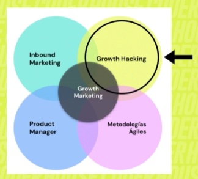

## 🌱 Introducción al Growth Marketing  

El **Growth Marketing** es una estrategia enfocada en el crecimiento sostenible de un producto, servicio o marca mediante la combinación de **datos, creatividad y experimentación constante**.  
A diferencia del marketing tradicional, que se centra solo en la adquisición de clientes, el growth marketing abarca todo el embudo (**adquisición, activación, retención, revenue y referral**).  

### 🚀 Pilares del Growth Marketing
- 🔍 **Análisis de datos** para tomar decisiones basadas en evidencia.  
- 🧪 **Pruebas y experimentos A/B** para optimizar resultados.  
- 🎯 **Segmentación avanzada** para llegar a las personas correctas en el momento adecuado.  
- ♻️ **Ciclo iterativo**: probar, medir, aprender y escalar lo que funciona.  

👉 En pocas palabras: el growth marketing no busca crecer rápido a cualquier costo, sino crecer **inteligente, rentable y de manera sostenible**.  

## 🔗 Growth Marketing y su relación con otras disciplinas  

El **Growth Marketing** no vive aislado, sino que se nutre de varias áreas y metodologías que potencian su efectividad.  

### 🧨 Growth Hacking  
- El growth hacking es como el "hermano rebelde" del growth marketing.  
- Se enfoca en **experimentar rápido, barato y con creatividad extrema** para encontrar palancas de crecimiento.  
- Growth Marketing toma esa mentalidad, pero la aplica con un enfoque más **estratégico, sostenible y orientado a métricas de negocio**.  

### 🎯 Inbound Marketing  
- El inbound busca **atraer clientes de forma orgánica** con contenido de valor.  
- El Growth Marketing incorpora inbound como **motor de adquisición** y lo complementa con pruebas, automatización y análisis de todo el embudo.  

### 👩‍💻 Product Manager  
- El PM busca alinear **producto, negocio y usuario**.  
- El Growth Marketer colabora de cerca con el PM, ya que **el producto también es un canal de crecimiento** (ej: referral programs, onboarding optimizado, upselling dentro de la app).  

### ⚡ Metodologías Ágiles  
- Growth Marketing se lleva de la mano con lo ágil:  
  - **Sprints cortos** para lanzar y validar experimentos.  
  - **Scrum/Kanban** para organizar el backlog de hipótesis.  
  - **Iteración continua**: probar → medir → aprender → escalar.  

👉 En resumen:  
El **Growth Marketing** es el puente entre la **creatividad del growth hacking**, la **atracción orgánica del inbound**, la **visión estratégica del product manager** y la **agilidad de los equipos modernos**.  

## 🎯 Growth Marketing, Buyer Persona y Funnel  

El **Growth Marketing** no solo consiste en lanzar experimentos al azar:  
todo empieza entendiendo **a quién** y **dónde** vamos a impactar.  

### 👤 Buyer Persona  
- El buyer persona es la **representación semi-ficticia del cliente ideal**.  
- En Growth Marketing, conocer al buyer persona permite:  
  - Diseñar experimentos alineados a sus dolores y motivaciones.  
  - Personalizar mensajes y canales.  
  - Optimizar recursos evitando llegar a audiencias irrelevantes.  

En pocas palabras: **sin un buyer persona claro, el growth sería disparar con los ojos cerrados**.  

### 🌀 Funnel de Conversión  
- El funnel es el **mapa del recorrido del usuario**: desde conocerte hasta convertirse en cliente fiel.  
- El Growth Marketing se mete en cada etapa:  
  1. **Awareness** → pruebas de adquisición (ads, SEO, partnerships).  
  2. **Consideración** → nurturing, inbound, pruebas de engagement.  
  3. **Conversión** → optimización de landing pages, CTAs y UX.  
  4. **Retención** → emails, notificaciones, programas de lealtad.  
  5. **Revenue / Referral** → upselling, cross-selling, programas de referidos.  

Cada hipótesis o experimento de growth debe mapearse al **funnel** y al **buyer persona**:  
👉 **qué usuario**, 👉 **en qué etapa**, 👉 **con qué mensaje**.  

📌 **Conclusión**:  
El **buyer persona** da la brújula y el **funnel** marca el terreno de juego.  
El Growth Marketing une ambos para **experimentar de forma estratégica**, lograr impacto real y escalar resultados.  

