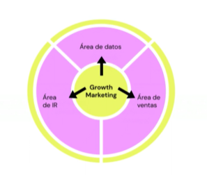

# 🚀 ¿Qué hace un Growth Marketer?

Un **Growth Marketer** es como el “arquitecto del crecimiento” de un negocio digital.  
No se queda solo en hacer campañas bonitas: mezcla marketing, data, psicología del usuario y producto para que la empresa crezca de forma **sostenible, medible y escalable**.  

## 🛠️ Principales tareas de un Growth Marketer  

- 🔍 **Investigación y análisis**: estudia al *buyer persona*, analiza el mercado y mide resultados con datos.  
- 🧪 **Experimentación continua**: aplica el método científico → hipótesis, test (A/B), análisis de métricas y mejoras.  
- 🎯 **Optimización del funnel**: identifica cuellos de botella en cada etapa (Awareness, Consideración, Conversión, Retención, Referral) y propone soluciones.  
- 💡 **Creatividad + Data**: combina ideas innovadoras con insights cuantitativos y cualitativos.  
- 🤝 **Colaboración cross-team**: trabaja con marketing, producto, ventas y desarrollo para alinear esfuerzos.  
- 📈 **Escalabilidad**: busca que las acciones no solo den resultados hoy, sino que sean repetibles y sostenibles en el tiempo.  

✨ En resumen: un Growth Marketer no piensa solo en vender más, piensa en **cómo hacer crecer todo el ecosistema de la empresa**.  

