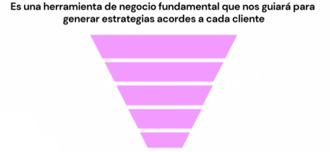

# 🔄 ¿Qué es un Funnel de Conversión?

El **funnel de conversión** (o embudo de conversión) es un modelo que representa el camino que sigue un usuario desde que conoce una marca hasta que realiza una acción deseada (compra, registro, suscripción, etc.).  

Se llama *embudo* porque, al inicio, muchas personas entran en contacto con la marca, pero solo una parte de ellas termina completando la conversión.  



## 📍 Etapas del Funnel de Conversión

1. **Awareness (Atracción / Conocimiento)**  
   El usuario descubre que existes. Ejemplo: anuncios, redes sociales, blogs.  

2. **Consideración (Interés / Evaluación)**  
   El usuario investiga y compara tu producto/servicio. Ejemplo: leer un caso de éxito, revisar reseñas, visitar tu web.  

3. **Conversion (Decisión / Acción)**  
   El usuario toma la decisión de convertirse en cliente. Ejemplo: compra, registro, suscripción.  

4. **Retention (Fidelización)**  
   El cliente sigue interactuando con la marca. Ejemplo: emails personalizados, programas de lealtad.  

5. **Referral (Recomendación)**  
   El cliente satisfecho recomienda tu marca. Ejemplo: reseñas, boca a boca, compartir en redes.  

## 🔽 Esquema visual (ASCII)

```text
Awareness    🔵🔵🔵🔵🔵🔵🔵🔵🔵
Consideración 🔵🔵🔵🔵🔵
Conversión     🔵🔵
Retención       🔵
Referral         ⭐
```

✨ En resumen: el funnel de conversión ayuda a **entender**, **medir** y **optimizar** cada punto de contacto con el usuario para aumentar la probabilidad de que llegue hasta el final del embudo.

# 🔄 Tipos de Funnel de Conversión

Un **funnel de conversión** no siempre es igual, depende del enfoque y del objetivo que se busque en el negocio.  
En general, podemos dividirlos en **tres tipos principales**:

## 🚀 1. Funnel de Growth Marketing
- Se centra en **experimentar y optimizar** cada etapa del recorrido del usuario.  
- Su objetivo es encontrar **palancas de crecimiento escalables**.  
- Incluye métricas como: adquisición, activación, retención, revenue y referral (modelo AARRR o *Pirate Metrics*).  
- Ejemplo: probar diferentes CTAs en un landing para mejorar la conversión.

## 🎯 2. Funnel de Inbound Marketing
- TOFU, MOFU, BOFU
- Enfocado en **atraer y educar** a los usuarios mediante contenido de valor.  
- Se compone de las etapas: **Atracción → Conversión → Cierre → Deleite**.  
- El usuario avanza de ser un **desconocido** a convertirse en **cliente fiel** gracias a estrategias como blogs, SEO, email marketing y automatización.  
- Ejemplo: un artículo optimizado en Google que lleva a un ebook gratuito y, luego, a una demo del producto.

## 💰 3. Funnel de Ventas
- Diseñado para llevar a los leads más **calificados** hacia la **compra final**.  
- Está muy ligado al trabajo de los equipos de ventas y al cierre de oportunidades.  
- Se divide en 5 partes: consciencia, interés, consideración, intención, acción
- Se compone de: **Prospección → Calificación → Presentación → Negociación → Cierre**.  
- Ejemplo: un lead que deja sus datos en un formulario, recibe seguimiento de un vendedor y finaliza comprando.

✨ En resumen:  
- El **funnel de growth marketing** busca escalar con datos y experimentación.  
- El **funnel de inbound marketing** construye relaciones a través de contenido.  
- El **funnel de ventas** se centra en cerrar negocios y generar ingresos.  
