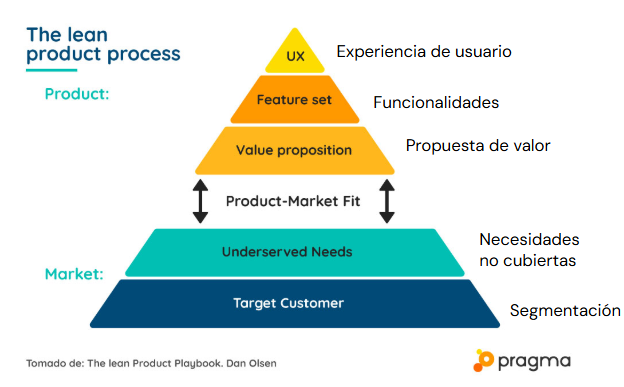
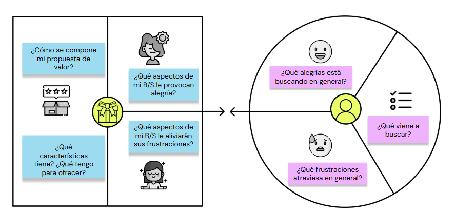
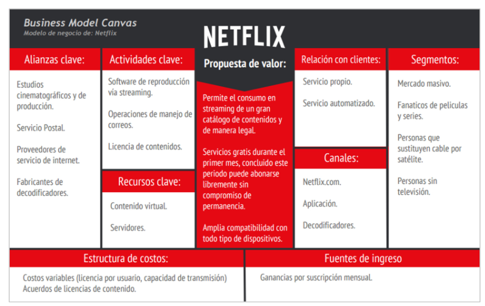

# Product market fit
Este es un concepto que nos **ayuda a saber hasta qué punto nuestro producto es capaz de satisfacer una demanda de mercado**, como un producto estrella, lo cuál es fundamental a la hora de minimizar el riesgo de posibles fracasos. 

En este sentido el Product Market Fit es, básicamente, cuando tu producto "encaja" en el nicho al que se apunta, y esto lo lelgamos a validar porque los usuarios responden de manera positiva a tu oferta, es decir, **se cumplen con los objetivos de marketing planteados**. 

Lo pirmero es analizar el **mercado**. Identificar el **público** y sus **necesidades** descubiertas. Una vez que esto está bien asentado es cuando vamos a empezar a definir cuál es nuestro producto. 

Posterior a esto se define la **propuesta de valor**, qué funcionalidades debe de tener y luego todo lo que tenga que ver con la **experiencia del usuario** utilizando nuestro producto. 

  

El momento para hacer estos experimentos o validaciones en busca del “producto perfecto” es uno de los primeros pasos en una estrategia de growth, previo al momento en el que lanzamos el producto y la estrategia de marketing al mercado. 
Se basa en 3 pilares: 
- Un cliente dispuesto a pagar por tu servicio o producto (lo que definiste que vale).
- Lo que cuesta producir el producto debe ser menor de lo que vas a recibir por el mismo (utilidad).
- Comprobar que el mercado es lo suficientemente grande o receptivo a nuestra idea

> 📌Nota: Sin ninguno de estos elementos, estaremos construyendo una oferta que no tiene ningún sentido.

## En busca del match🧩
Una manera muy útil de encontrar un punto de equilibrio entre la oferta de nuestro negocio y las necesidades de los usuarios es a  través de la construcción de un **Value Proposition Canvas**.

Esta es una herramienta sumamente práctica para volcar en un lienzo nuestro modelo de negocio, mediante el análisis de dos grandes componentes: el **usuario** y el **producto**.

  

  

# Business model canvas

  

## Ejemplo: Netflix

  

# North Star Metric
La North Star Metric (NSM) es una métrica utilizada por las empresas para focalizar su crecimiento.

Refleja el valor aportado por la compañía a sus clientes y, además, da dirección a largo plazo, guiando a la compañía hacia su visión en lugar de focalizarse en acciones de corto plazo.

La idea principal que apoya la NSM es que **si tu empresa aporta más valor a tus clientes, el crecimiento de tu compañía tiene que ser positivo**.

## Definición de la NSM
- ¿Por qué es importante? ¿Para qué sirve?
    - Cuantificar la entrega de valor de tu producto a tus usuarios
    - Permite medir el crecimiento sostenible de la empresa
    - Nos marca el rumbo, el norte: Los tests planteados deben orientarse hacia mejorar la NSM
    - Esta definición nos permite evitar caer en métricas de vanidad cómo clics, impresiones, descargas, registros, etc.

> **En definitiva, nos va a permitir medir el impacto de las acciones que hagamos**

## 4 Preguntas para definir la NSM
- ¿Cuál es el rol de tu equipo en la empresa?
- ¿Cuál es el valor principal que reciben tus usuarios?
- ¿Cómo puedes cuantificar ese valor?
- ¿Qué alinearía a todas las unidades de la empresa?

> Los ingresos son el precio que pagan tus clientes. La NSM es el valor que reciben a cambio de ese precio.

## Ejemplo

  
