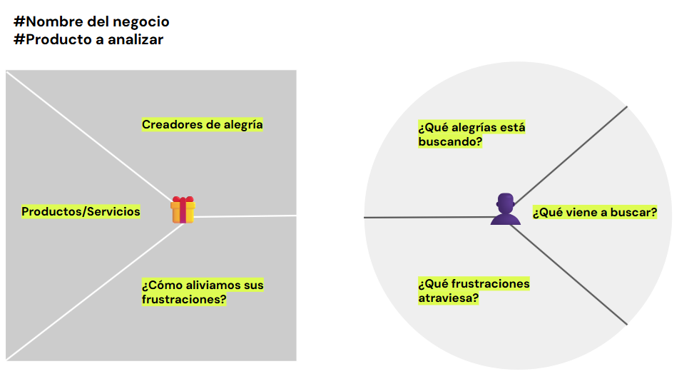
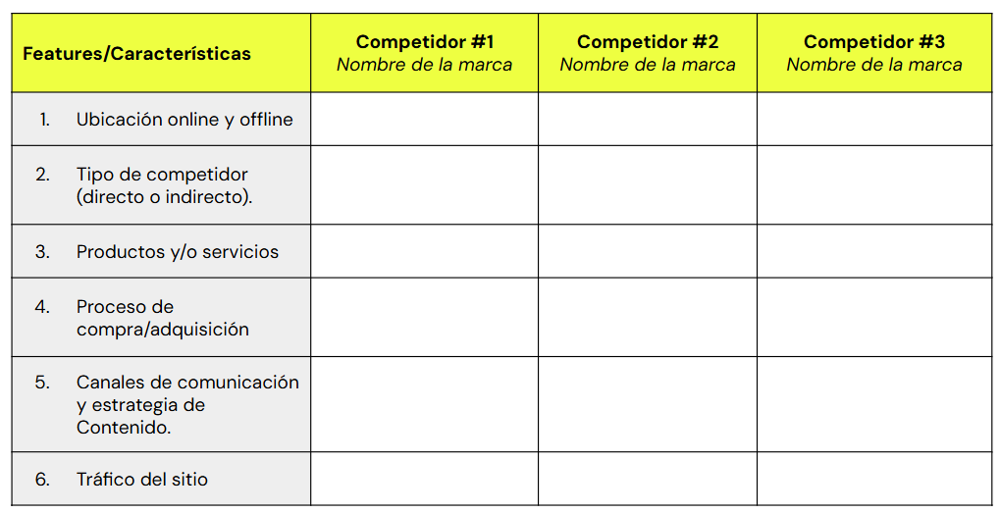
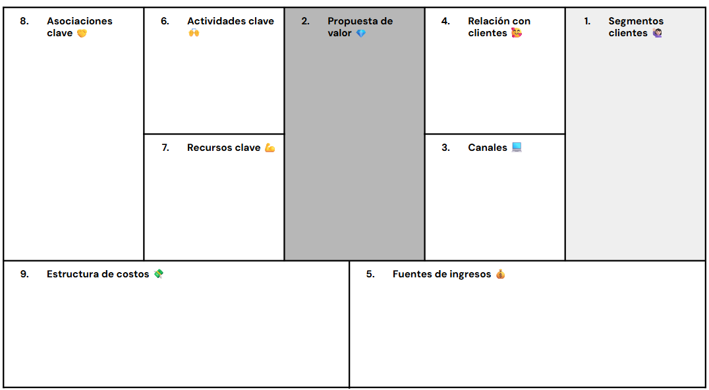

# Actividad Práctica: Despega con Growth Marketing: ¡Prepárate para impulsar tu estrategia!

## Primera práctica. Brief del proyecto de Growth Marketing
### Consigna
Confecciona un pequeño brief donde definas el negocio, emprendimiento o proyecto sobre el cual desarrollarás tu estrategia de Growth Marketing y justifica/enumera las razones por las cuales se aplicará una estrategia como esta.✍🏼

### 📌Tip
Puedes usar como referencia los brief que se suelen utilizar en las reuniones de equipo, donde quede bien en claro la oferta del cliente, a quiénes debemos comunicar y cuál será el foco del mensaje.

### Aspectos a incluir
- Nombre del proyecto
- Idea de negocio y tipo (B2B/B2C)
- Oferta de mercado (producto/servicio)
- Target al que apunta
- Necesidad o problema de los usuarios
- Justificación de la estrategia de GM

--- 

## Segunda práctica: Product Market Fit & Benchmark
### Consigna
Construye el Product Market Fit de tu negocio mediante la herramienta de Value Proposition Canvas (VPC), y realiza un Benchmark con tus principales competidores (breve relevamiento de tu competencia).

### Aspectos a incluir:
- VPC: Completa el canvas en sus 2 componentes usuario y producto detallando cada uno de los 6 cuadrantes y define el product market fit.
- Benchmarking: analiza al menos a 3 competidores
    - Nombre de la marca y ubicación.
    - Tipo de competidor (directo o indirecto).
    - Productos y/o servicios que ofrece
    - Proceso de compra/adquisición.
    - Canales de comunicación (RRSS/Web/Otros) y estrategia de Contenido.
    - Tráfico del sitio, ¿de dónde proviene?

### 📌Tip
Puedes emplear algunas de las siguientes aplicaciones/herramientas para realizar el Benchmarking, y visitar los sitios de la competencia:
- Google Trends
- Semrush
- Similarweb
- Phlanx: Social Media Marketing Platform

--- 

## Tercera práctica: Business Model Canvas
### Consigna
Desarrolla el Business model canvas de tu proyecto teniendo detallando información en cada uno de los 9 cuadrantes que lo conforman. Ten en cuenta lo aprendido en clase y el video recomendado.

### Aspectos a incluir
Al menos 3 ítems que brinden información por cuadrante.
- Segmento mercado/clientes (VPC)
- Propuesta de valor (VPC)
- Canales
- Relación con los clientes
- Fuentes de ingreso
- Actividades clave
- Recursos Clave
- Partners claves
- Estructura de costos

### 📌Tips
- En caso de que alguna sección no pueda ser completada por falta de información, justificar con observaciones.

--- 

## Cuarta práctica: Definición de la North Star Metric
### Consigna
Define la métrica estrella (NSM) de tu negocio que orientará la toma de decisiones en todas las instancias de armado de la estrategia de Growth y armado de experimentos.

### 📌Tip
Puedes usar como referencia el ejemplo que compartimos en clase para poder adaptar lo que vimos al negocio sobre el que vas a armar tu proyecto final.

### Aspectos a incluir
Para llegar a la NSM, responde las 4 preguntas que te ayudarán a definir esta métrica.
- ¿Cuál es el rol de tu equipo en la empresa?
- ¿Cuál es el valor principal que reciben tus usuarios?
- ¿Cómo puedes cuantificar ese valor?
- ¿Qué alinearía a todas las unidades de la empresa?

--- 

## Recursos

  

  

  
