# Clase en vivo: Estrategias de Growth Marketing

## Descubriendo a tu audiencia ideal

- **Identificar al cliente ideal**: Está actividad te permite entender quiénes son tu clientes más valiosos, cuáles son sus características demográficas, psicográficas y de comportamiento. Esto te ayuda a dirigir tus esfuerzos de marketing hacia aquellos que tienen más probabilidades de estar interesados en tus productos o servicios. 
- **Explicar por qué es importante**: Comprender por qué tu cliente ideal es crucial para tu marca te ayuda a enfocar tus recuersos en satisfacer sus necesidades y deseos. Al alinear tu oferta con lo que este cliente valora, puedes diferenciarte de la competencia y construir relaciones sólidas y duraderas con tus clientes. 
- **Identificar los momentos de búsqueda de tu marca**: Reconocer los momentos clave en el viaje del cliente donde buscan interactuar con tu marca te permite estar presenteen los momentos oportunos con mensajes relevantes y oportunidades que satisfagan sus necesidades en cada etapa. Esto te ayuda a maximizar el impacto de tus esfuerzos de marketing y a mejorar la experiencia del cliente.

## ¿Qué son los Buyer Personas?
Es la representación semi-fictica de nuestro cliente ideal. 

### Tipos de Buyer Persona 
Según la profundidad con la que queramos/podamos hacer el análisis del **Buyer Persona**, podemos identificar distintos tipos de Buyer Persona. Aquí analizaremos 3 de ellos que son los que se utilizan más frecuentemente: 
- Proto/Personas
- Marketing Personas
- Design Persona

#### Proto Persona 

 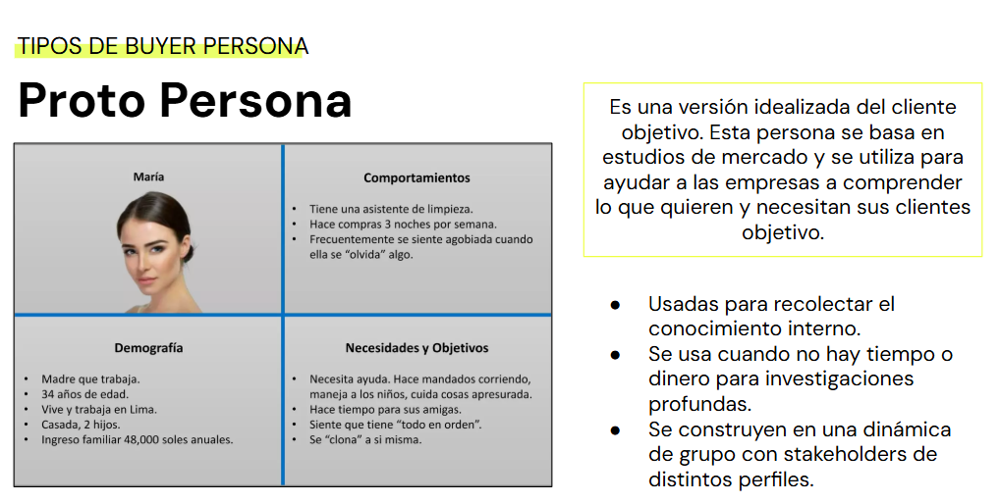 

#### Marketing Persona

 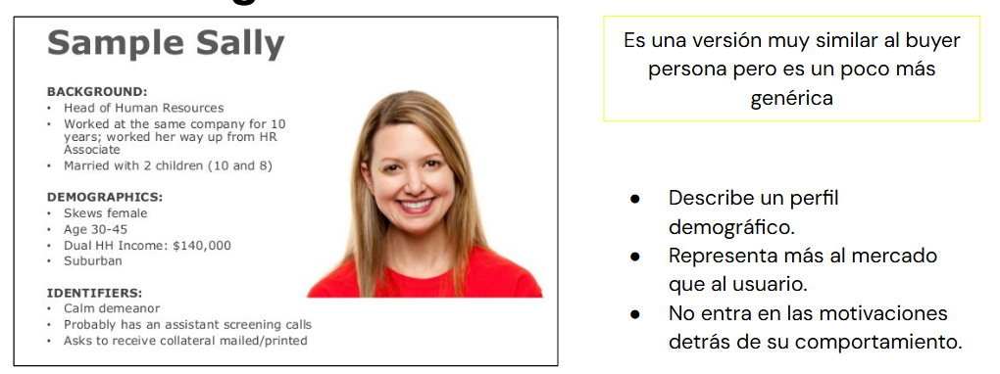 

#### Design Persona

 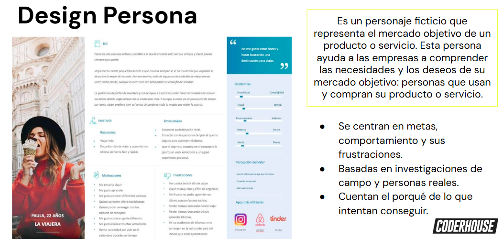 

### Pasos para crear un Buyer Persona 

  

## Buyer Persona
- **Descubrir**: Entrevistas a los clientes actuales y potenciales. Comenzar preguntándole sobre ellos/ellas y como es un día “regular” en su vida (definimos el contexto).
- Clasificar las preguntas por: trabajo, datos demográficos, pareja/familia, medios que consume, momento de compra, etc. 
- No olvidar indagar sobre sus experiencias pasadas, objetivos y frustraciones. 
- **Cuantificar**: encuestas.

### Ejemplo

 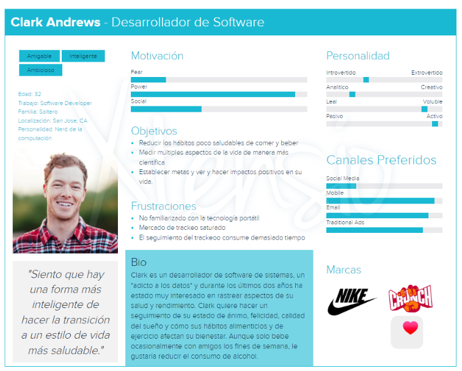 

### Detalles sobre el Buyer Persona
| Categoría                | Pregunta  |
|---------------------------|-----------------------------|
| **Función**              | ¿Cuál es tu función laboral y en la vida?   ¿Cómo es un día normal para ti?    ¿Qué habilidades se requieren para esta función?   ¿Qué información y herramientas utilizas? |
| **Empresa**              | ¿En qué industria o industrias se desempeña tu empresa/función laboral?   ¿De qué tamaño es tu empresa/organización (ingresos, número de empleados)?   |
| **Objetivos**            | ¿Cuáles son tus responsabilidades?   ¿Cómo sabes si tu función está siendo exitosa? |
| **Desafíos**             | ¿Cuáles son tus mayores desafíos? | 
| **Fuentes de Información** | ¿Cómo obtienes nueva información para tu trabajo?   ¿Qué publicaciones o blogs lees?   ¿A qué asociaciones o redes sociales perteneces? |
| **Antecedentes personales** | Edad    Estado familiar (casado, con hijos)  Educación |
| **Preferencias de compra** | ¿Cómo prefieres interactuar con los proveedores?   ¿Utilizas Internet para obtener más información sobre los proveedores o servicios?  Si es así, ¿cómo buscas esa información?  |    

## En cifras
Según un estudio realizado por Semrush en 2020 sobre marketing basado en personas:

 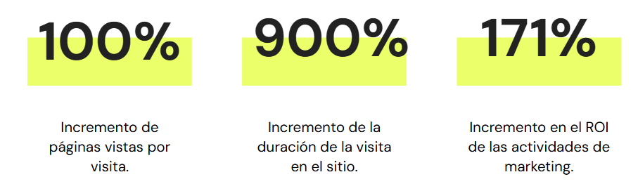 

Según el mismo estudio, quienes más se benefician en la definición de buyer personas son:
- Equipos de atención al cliente
- Equipos de producto
- Equipos de ventas
- Equipos de marketing

## Tipos de Growth Loops 

 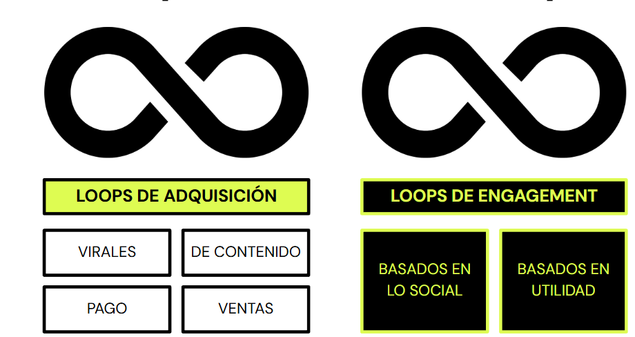 

### Ejemplo Loop de Adquisición 

 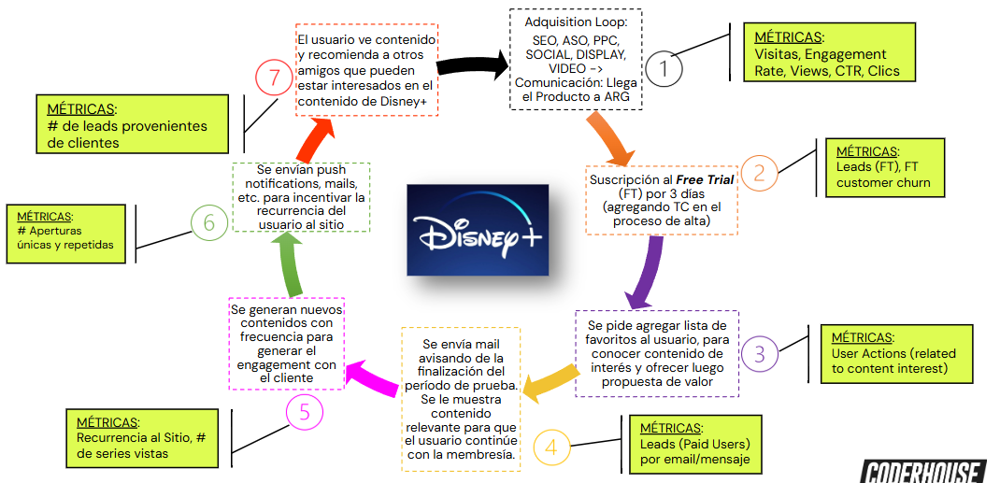 

## Funcionamiento del Growth Loop
- **Loop de Adquisición**: Para comunicar la llegada del producto al mercado argentino. Pauta PPC, Social, Video y Display.
- **Output**: para que el usuario sepa del lanzamiento y solicite el Free Trial (FT)
- **Acción**: FT solicitando al usuario que defina contenido favorito en su perfil.
- **Recompensa**: Si te quedás, tenés todo esto para seguir disfrutando (3 días del FT no bastan para consumir contenido tan valioso y extenso)
- **Retención**: Le damos razones al usuario para que se quede y siga disfrutando del mejor contenido exclusivo.
- **Disparador**: Señales externas (push notifications, mails) o internas (en la app cuando el usuario entra) que incitan al usuario a realizar una acción (“engancharse a un nuevo contenido”)
- **Referidos**: El usuario recomienda la experiencia y contenidos a amigos que pueden estar interesados en probar el FT.  

## Etapa de adquisición
Proceso de atracción de potenciales clientes a tu marca. El objetivo es lograr que conozcan y se familiaricen con el producto o servicio. 

### Antes de definir la estrategia de Adquisición 💡
- Entender las necesidades y el comportamiento de los clientes potenciales y actuales
- Validar Hipótesis y encontrar oportunidades
- Ahorrar Tiempo y dinero creando cosas que los clientes realmente quieren
- Incrementar la Tasa de Conversión
- Mejorar la Experiencia del Cliente y ofrecer una atención Top

## Growth Roadmap

 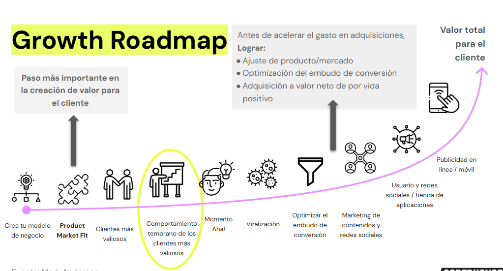 

## Plan de acción

 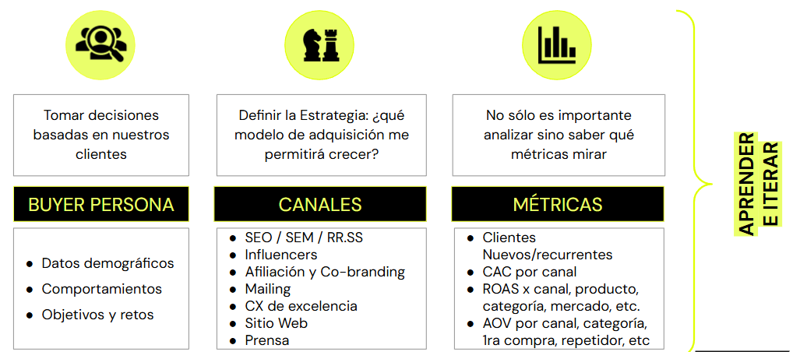 

## ¿Cómo llegan los consumidores al producto que aman?

 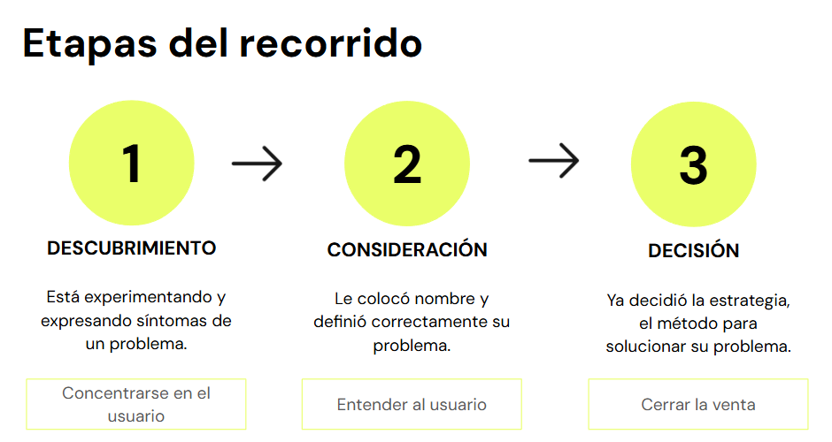 

## Distribución de los touchpoints

 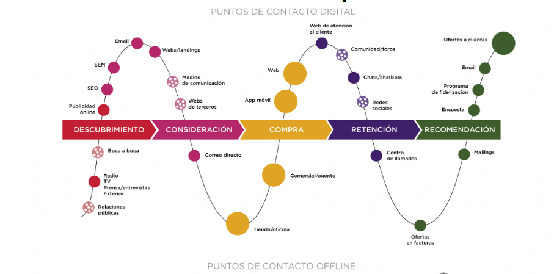 

## Ejemplo: el CJM de Papá Noel

 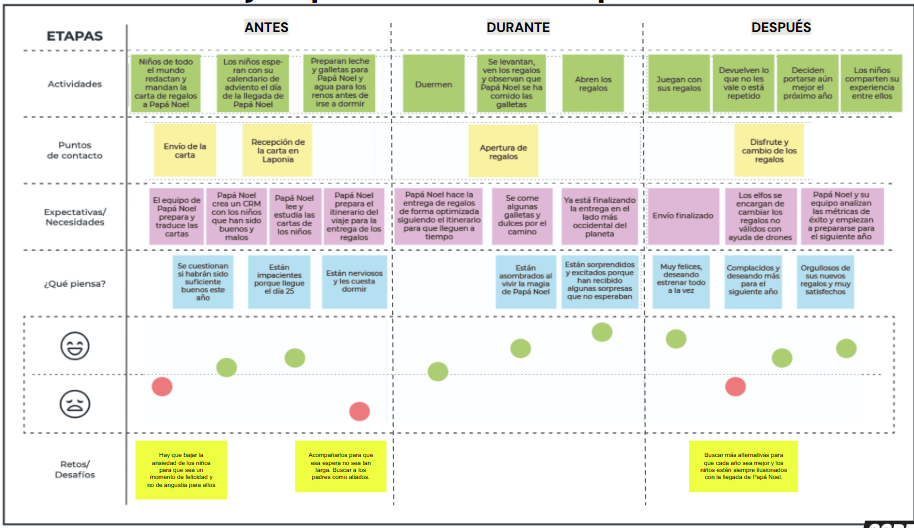 

## Ejemplo: Customer Journey Map

 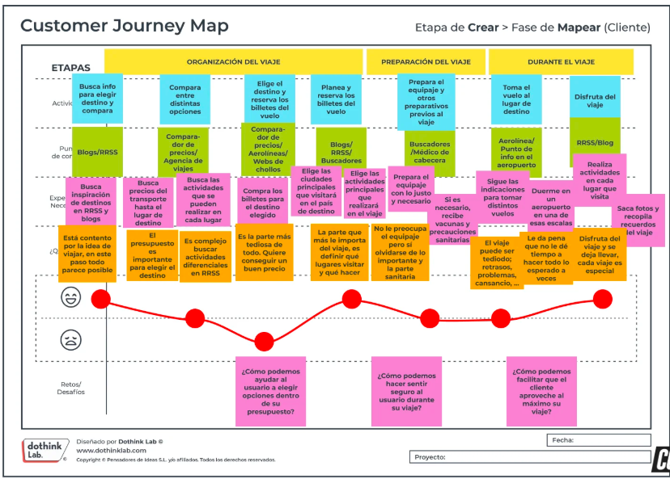 
