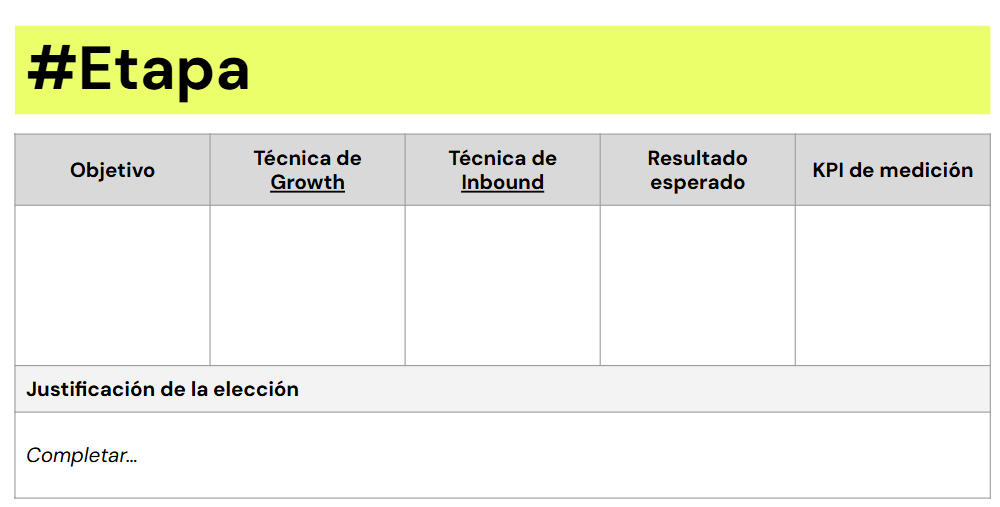
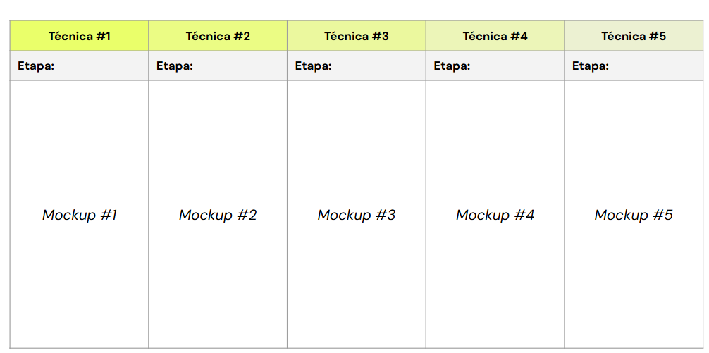
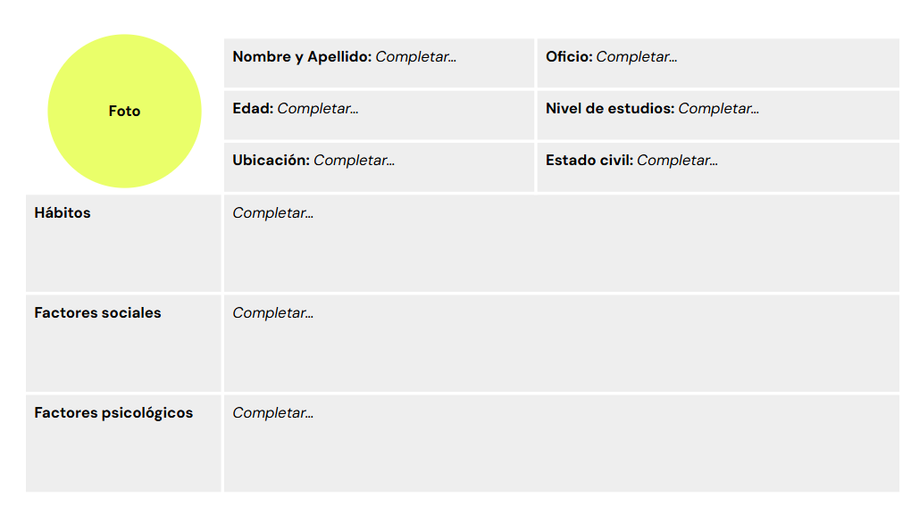
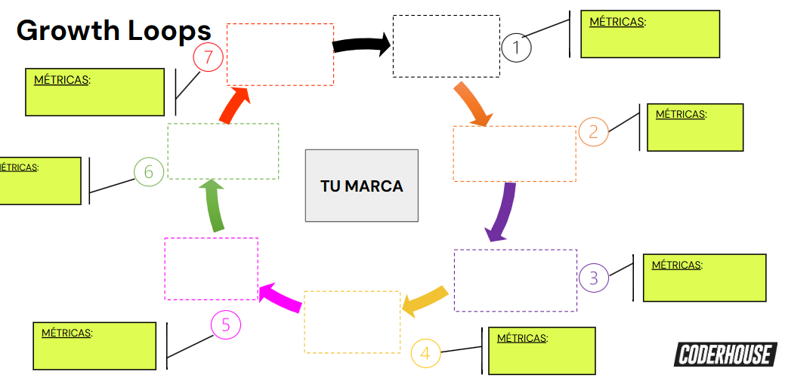

# Actividad Práctica: Adquisición y activación de usuarios para el crecimiento sostenido

## Combinación de técnicas de Inbound & Growth
- Consigna: 
    - Plantea mínimo 3 técnicas de Inbound (máximo 5) que puedan ser potenciadas con 5 técnicas de Growth Marketing para fortalecer los vínculos con clientes, tal y como se trabajó en clases. 
- Aspectos a incluir:
    - Definir un objetivo por cada técnica.
    - Especificar el momento de la estrategia en el que se aplicará (etapa del embudo).
    - Mencionar el resultado esperado.
    - Especificar qué KPI’s usarías para medir cada propuesta.
    - Justificación de la elección.
- 📌Tip:
    - Puedes trabajar en base a las 5 técnicas establecidas en la práctica anterior o establecer nuevas.
    - Incorpora elementos visuales (mockups o imágenes referenciales) que ayuden a ejemplificar lo mencionado.

--- 

## Armando nuestro Buyer Persona
- Consigna: 
    - Perfila a tu(s) cliente(s) ideal(es) (máximo 3) y detalla toda la información que pueda ser necesaria y útil para levantar una estrategia de Growth Marketing. 
    - En este sentido crea un listado de las preguntas que te ayudarán a entender y definir tu(s) Buyer(s) Persona(s) y en base a lo que vayas descubriendo, confecciona el(los) perfil(es).
- Aspectos a incluir:
    - Datos demográficos y foto
    - Datos sobre preferencias
    - Datos sobre hábitos sociales
    - Factores psicológicos
- 📌Tip: 
    - una vez que hayas contestado a cada una de las preguntas que te formulaste aplica los datos obtenidos al buyer persona con la herramienta de Hubspot (Generador de BP).
- Recursos:
    - Generador de Buyer Persona: https://www.hubspot.es/make-my-persona 
    - Xtensio Arquetipos: https://xtensio.com/user-persona-template/

---

## Growth Loops
- Consigna: 
    - Definir un modelo teórico de Growth Loop con el fin de ir modelando la estrategia para el desarrollo del plan integral de Growth, según lo trabajado en clases.
- Aspectos a incluir:
    - Definir el ciclo más conveniente para nuestro negocio (de adquisición o engagement) y trabajar sobre él.
    - Mapear métricas y/o micro-conversiones asociadas a cada paso del loop.
    - Explicar el funcionamiento del loop

---

## Recursos

  

  

  

  
