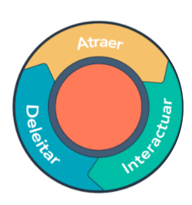
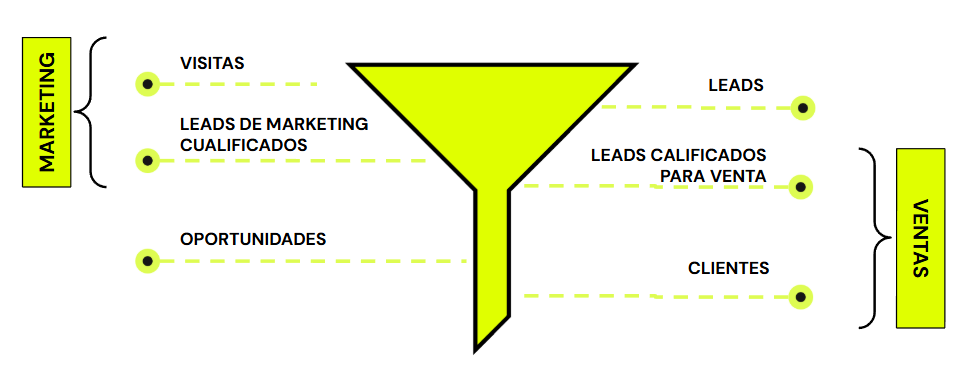
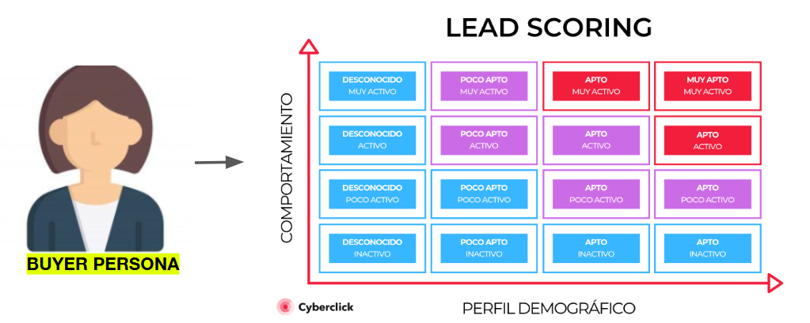
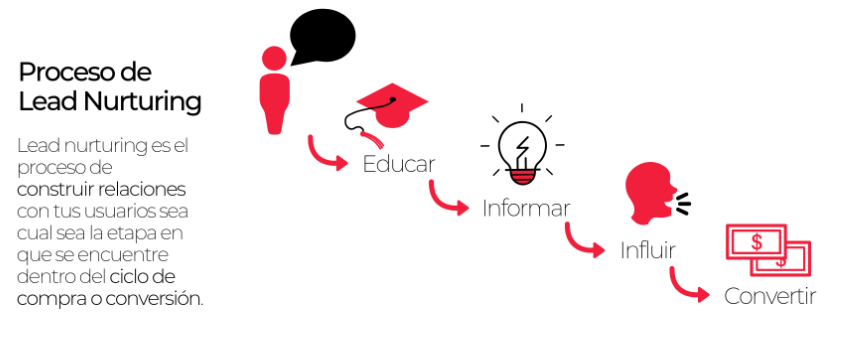
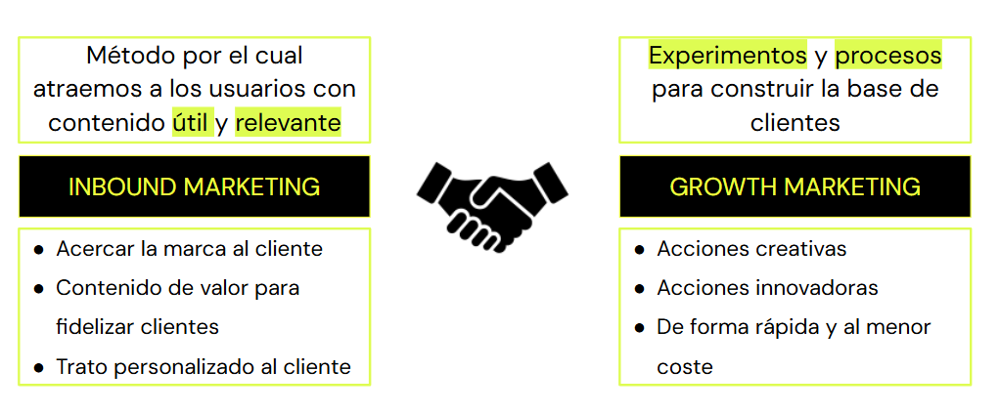
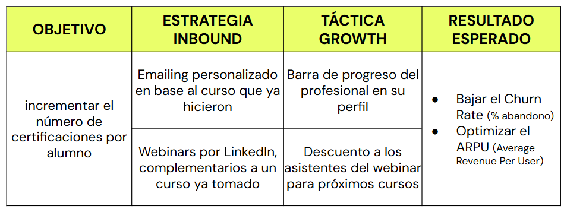
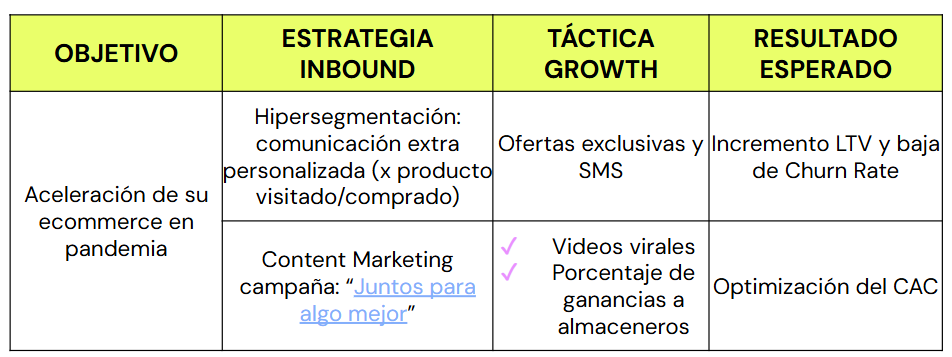

# Clase en vivo: Estrategias de crecimiento y ads
## Maximizando el potencial: Estrategias de contenido y Growth Marketing en canales seleccionados
- **Desarrollo de habilidades**: Los participantes tienen la oportunidad de mejorar sus habilidades en marketing digital, específicamente en la identificación de canales efectivos y la implementación de estrategias de contenido y growth marketing.
- **Aplicación práctica**: Permite aplicar los conocimientos teóricos en un escenario práctico y relevante para el ámbito laboral.
- **Optimización de recursos**: Al identificar los canales más adecuados para compartir contenido, las empresas pueden optimizar sus recursos y esfuerzos de marketing, maximizando así el retorno de la inversión.
- **Incremento del alcance y engagement**: Al implementar estrategias efectivas en los canales seleccionados, se puede aumentar el alcance de la marca y mejorar el engagement con la audiencia objetivo.
- **Mejora de resultados**: Al capitalizar los canales correctamente con tácticas de growth marketing, se pueden lograr resultados tangibles, como un aumento en el tráfico del sitio web, la generación de leads y la retención de clientes.

> En resumen, resolver este desafío ayuda a desarrollar habilidades, optimizar recursos y mejorar los resultados de marketing digital de una empresa.

## Inbound Marketing
### Relaciones
- **Herramientas para Deleitar**
    - Contenido inteligente 
    - Email marketing
    - Bandeja de entrada de conversaciones
    - Informes de atribución
    - Automatización del marketing
- **Herramientas para Atraer**
    - Anuncios
    - Video   
    - Publicación en blogs
    - Redes sociales
    - Estrategia de contenido
- **Herramientas para Interactuar**
    - Flujos de oportunidades de venta
    - Email marketing
    - Gestión de oportunidades de venta
    - Bots conversacionales
    - Automatización del marketing

  

## Funnel de ventas de Inbound

  

## Lead Scoring + Nurturing

  

  

## Resumen de las estrategias de Inbound Marketing vistas
| Estrategias Inbound | Atracción | Conversión | Cierre / Fidelización |
| ------------------- | --------- | ---------- | --------------------- |
| ​​🧲​ | Blog propio   Análisis de Kws   Posteos pagos (PPC) | Estrategia de contenidos (Ayudar, educar, entretener, inspirar, …) | Redes Sociales    Publicidad de contenidos | 
| ​​🤝​ | Call to actions    Landing Pages    Formularios | Lead Magnets   Descargas   Pop ups | Productos freemium   Reto   Concurso o sorteo |
| ​​🤐​ | Lead nurturing   Automatización de mails | Ofertas   Productos exclusivos   Ediciones limitadas | Última oportunidad    Beneficios e incentivos   Garantías |
| ​​👥​ | Encuesta de satisfacción | Descuentos próxima compra | Descuentos para amigos | 

### Recomendaciones
- Considerar al usuario siempre en el centro del contenido. 
- Producir contenido que merezca ser compartido. 
- El contenido siempre debe encantar, enamorar a la audiencia. 
- Usar las redes sociales como canales de distribución. 
- Desarrollar/producir subpáginas o landing pages destinadas a nichos del mercado. Ejemplo de páginas - empresas: LinkedIn

## Potenciando Growth Marketing con Inbound

  

## Canalizando Inbound con Growth 

  

### Ejemplo: Coca-Cola Store

  
