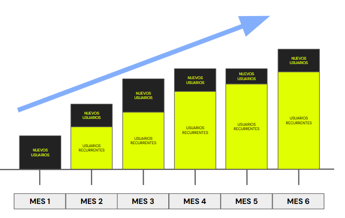
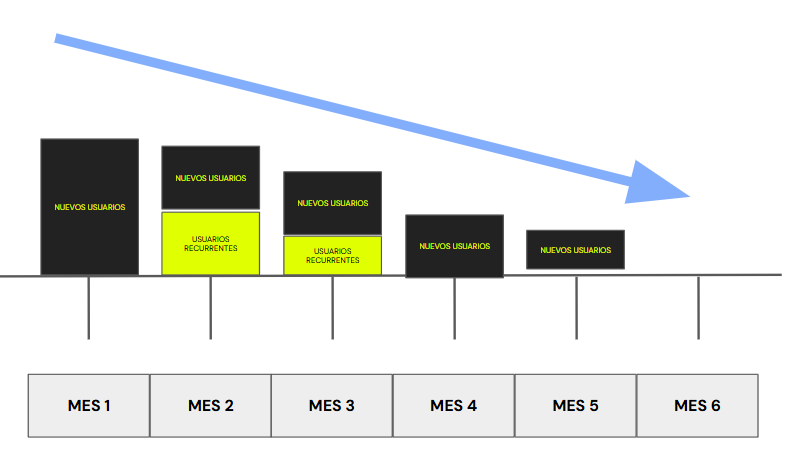
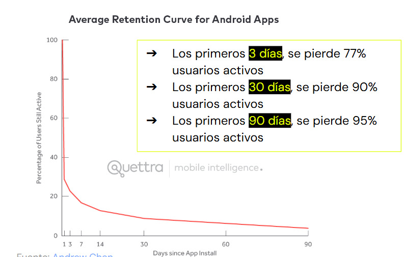
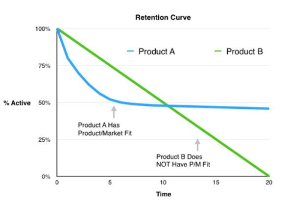

# ​​🎥​ Clase en vivo: Estrategias de crecimiento y ads
## Maximizando el potencial: Estrategias de contenido y Growth Marketing en canales seleccionados
- **Desarrollo de habilidades**: Los participantes tienen la oportunidad de mejorar sus habilidades en marketing digital, específicamente en la identificación de canales efectivos y la implementación de estrategias de contenido y growth marketing.
- **Aplicación práctica**: Permite aplicar los conocimientos teóricos en un escenario práctico y relevante para el ámbito laboral.
- **Optimización de recursos**: Al identificar los canales más adecuados para compartir contenido, las empresas pueden optimizar sus recursos y esfuerzos de marketing, maximizando así el retorno de la inversión.
- **Incremento del alcance y engagement**: Al implementar estrategias efectivas en los canales seleccionados, se puede aumentar el alcance de la marca y mejorar el engagement con la audiencia objetivo.
- **Mejora de resultados**: Al capitalizar los canales correctamente con tácticas de growth marketing, se pueden lograr resultados tangibles, como un aumento en el tráfico del sitio web, la generación de leads y la retención de clientes.

> En resumen, resolver este desafío ayuda a desarrollar habilidades, optimizar recursos y mejorar los resultados de marketing digital de una empresa.

## Inbound Marketing
### Relaciones

| Herramientas para Deleitar | Herramientas para Atraer | Herramientas para Interactuar |
| ------------------------- | ------------------------- | ------------------------- |
| Contenido inteligente | Anuncios | Flujos de oportunidades de venta |
| Email marketing | Video | Email marketing |
| Bandeja de entrada de conversaciones | Publicación en blogs | Gestión de oportunidades de venta |
| Informes de atribución | Redes sociales | Bots conversacionales |
| Automatización del marketing | Estrategia de contenido | Automatización del marketing |

  

## Funnel de ventas de Inbound

  

## Lead Scoring + Nurturing

  

  

## Resumen de las estrategias de Inbound Marketing vistas
|   | Atracción | Conversión | Cierre / Fidelización |
| ------------------- | --------- | ---------- | --------------------- |
| ​​🧲​ | Blog propio   Análisis de Kws   Posteos pagos (PPC) | Estrategia de contenidos    Ayudar    Educar    Entretener    Inspirar | Redes Sociales    Publicidad de contenidos | 
| ​​ğŸ¤â€‹ | Call to actions    Landing Pages    Formularios | Lead Magnets   Descargas   Pop ups | Productos freemium   Reto   Concurso o sorteo |
| ​​ğŸ¤â€‹ | Lead nurturing   Automatización de mails | Ofertas   Productos exclusivos   Ediciones limitadas | Última oportunidad    Beneficios e incentivos   Garantías |
| ​​👥​ | Encuesta de satisfacción | Descuentos próxima compra | Descuentos para amigos | 

### Recomendaciones
- Considerar al usuario siempre en el centro del contenido. 
- Producir contenido que merezca ser compartido. 
- El contenido siempre debe encantar, enamorar a la audiencia. 
- Usar las redes sociales como canales de distribución. 
- Desarrollar/producir subpáginas o landing pages destinadas a nichos del mercado. Ejemplo de páginas - empresas: LinkedIn

## Potenciando Growth Marketing con Inbound

  

## Canalizando Inbound con Growth 

  

### Ejemplo: Coca-Cola Store

  

## Retención: la clave del crecimiento
### Tipos de Churn Rate

| ✔️ Voluntario ​​ | ​❌ Involuntario |
| ---------- | ------------ |
| Experiencia poco satisfactoria o no satisfactoria con el producto/servicio adquirido. | Caídas en el intento de finalización de una compra. |
| Competencia fuerte que triunfa en la captación del cliente. | Datos de la tarjeta mal ingresados. |
| Se prescinde de los productos-servicios brindados. | Rechazo por parte del ente emisor. | 
| El cliente ya no puede costear el producto-servicio |Fallos en la pasarela de pagos. | 
| | Fallos en la red/conexión a internet |

#### Ejemplo de una empresa con retención del 100%
- Alta retención
- Product Mkt Fit
- Crecimiento exponencial

  

#### Ejemplo de una empresa con retención del 0%.
- Baja retención
- Sin Product Mkt Fit
- Dependemos de la adquisición: inversión alta
- No vemos crecimiento exponencial

  

### Cómo se ve la retención
Los primeros 3 días son claves para lograr retener a los usuarios activos

  

### ​​​📊​ Conclusiones
- Si los usuarios regresan, entonces pudimos resolver su problema o cubrir sus necesidades y, por tanto, hay PMF
- No sería posible crecer de forma sostenida sin PMF, por tanto, es clave velar por la retención.
- La retención mejora los ingresos.
- Los clientes satisfechos pueden referir nuestro B/S y, por ende, bajar el CAC.
- Que nuestro producto se centre en el usuario y su experiencia, hará que la retención se mantenga o aumente.

  
