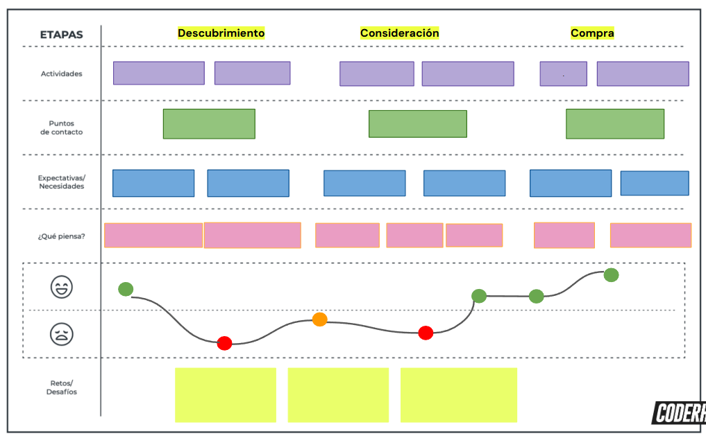
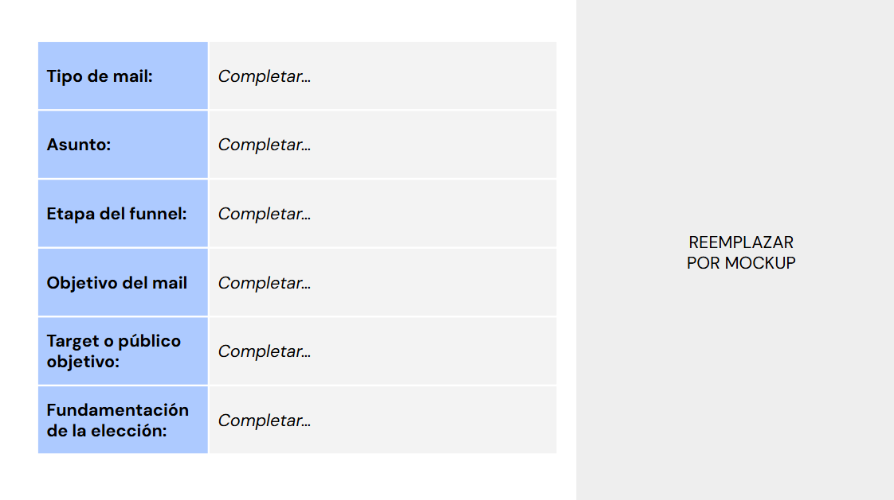
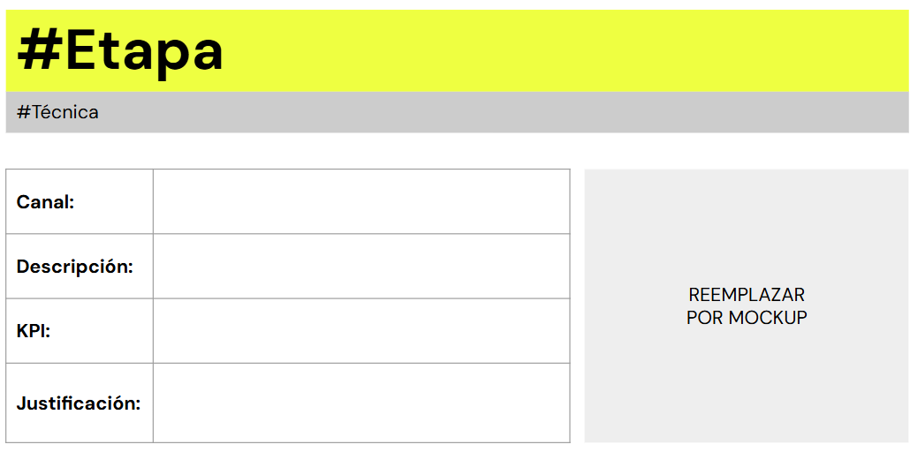

# 🤹​ Actividad práctica: Estrategias de crecimiento y ads

## Customer Journey Map
- Consigna:
    - Mapea el recorrido que crees podrían trazar tus consumidores para llegar a tu producto o servicio, según lo trabajado en clases.
- Aspectos a incluir:
    - Identificar al cliente
    - Fases o etapas de la relación
    - Motivaciones, dudas y emociones
    - Puntos de contacto o Touchpoints
    - Momentos Clave y Pain points
    - Sumar detección de oportunidades y conclusiones
- Tip: 
    - Puedes emplear alguno de los templates que se comparten en las siguientes páginas web o puedes utilizar alguna otra herramienta que te resulte fácil de usar como PowerPoint, Canva o Miro/Mural.

  

--- 

## Contenidos según el Buyer Journey
- Consigna:
    - Desarrolla al menos 3 contenidos para cada una de las etapas del Buyer Journey: descubrimiento, consideración y decisión, sin especificar aún los canales de comunicación.
- Aspectos a incluir:
    - Descubrimiento: contenidos relacionados a la necesidad del usuario (por ejemplo, posts como: “¿Por qué necesitás saber sobre Marketing digital?”, “5 razones para saber Marketing Digital”).
    - Consideración: contenido para que el usuario considere nuestra marca entre sus opciones de compra (por ejemplo: ebooks, whitepapers, testimoniales).
    - Decisión: contenido que lo ayude a elegir la mejor opción (descuentos exclusivos, demos, productos limitados, etcétera).
- Tip: 
    - Considera lo trabajado en la práctica anterior: Customer Journey Map.

  

---

## Técnicas de Growth Marketing
- Consigna:
    - Selecciona al menos 5 técnicas de Growth Marketing (de las vistas en clase) que consideres potenciarán tu negocio y tu comunicación con clientes/usuarios, vincúlalas a las etapas de adquisición, activación y retención, define los KPI’s relacionados y justifica su elección.
- Aspectos a incluir:
    - Mínimo 5 técnicas de Growth Marketing
    - Menciona por técnica el KPI vinculado.
    - Relación con las etapas de adquisición, activación y retención.
    - Argumentación acerca de la elección de dichas técnicas.
    - Mockups

  

---