# ​​🎥​ Clase en vivo: E-mail Marketing

## Los números hablan
- El email marketing es 40 veces más efectivo que las redes sociales para adquirir un nuevo cliente.
- Las personas suscritas a tu base de emails están **3 veces más predispuestas a compartir tu campaña en redes sociales**, en comparación con quienes las reciben directamente en sus redes.

 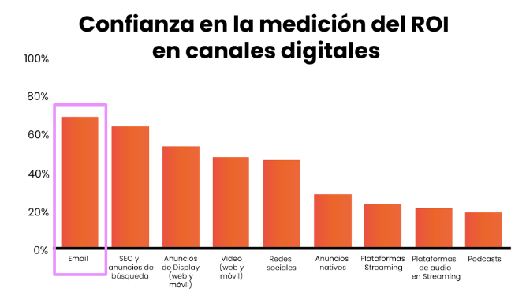 

## Estrategias de comunicación según el objetivo
### Primero y principal: Buyer Persona
Es un elemento que ya estaba definido, y no debe dejarse de lado. Será clave en todo el plan de acción, especialmente en email marketing.

### Segundo: propuesta de valor
Junto con el modelo de negocio y los objetivos, nos indicará cuánta importancia vamos a darle al email marketing según el mercado al que apuntemos, y cómo lo vamos a implementar.

## Los sectores con mayor tasa de apertura en sus campañas de email marketing en el 2022

 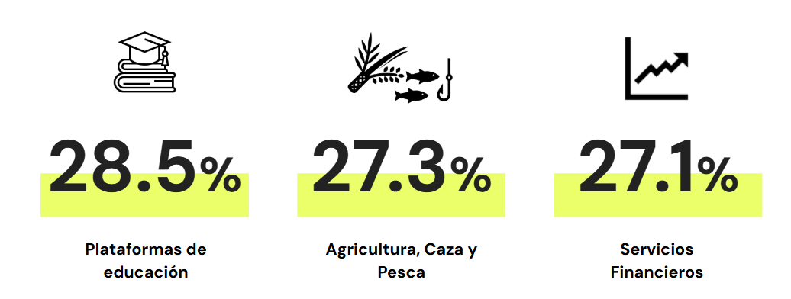 

 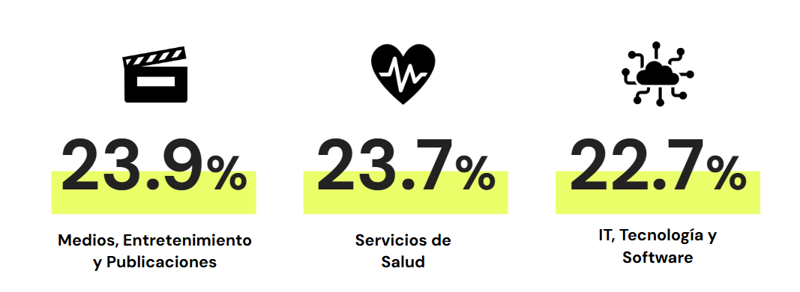 

## Las tácticas del email marketing más usadas, de acuerdo al embudo
### Adquisición
En el b2b, se invita a usuarios de una base de datos a establecer contactos y transformarse en leads.

 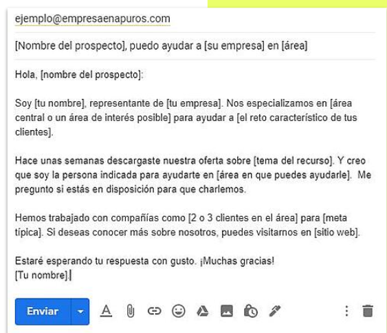 

Mediante una breve guía y educación del usuario, se busca la activación.

 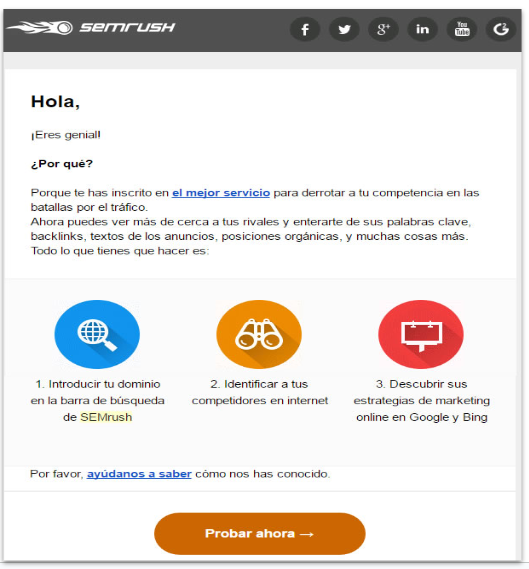 

### Retención
Puede recuperar el **18.64%** de carritos abandonados.

 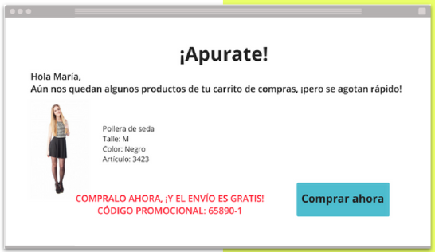 

### Referral
Se recurre a un programa de recompensas para que los usuarios conformes con el P/S nos refieran.

 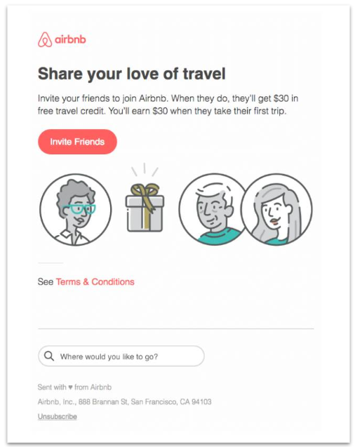 

### Revenue
Se aprovecha la oportunidad para aumentar el AOV y comunicar una recompensa en descuentos para completar la compra.

  
   

## Consideraciones para la estrategia
### En qué hacer foco

 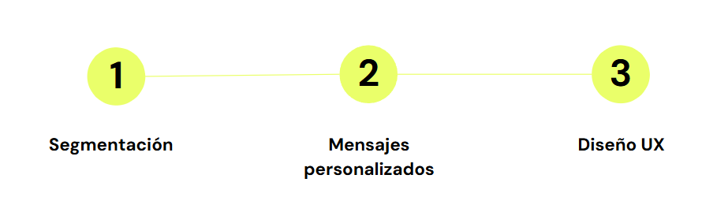 
   

### Mejores días de envío
- Los mejores días para enviar correos electrónicos son los **martes** para altas tasas de apertura.
- De todas formas, tanto miércoles como jueves, muestran una buena tasa de apertura.

 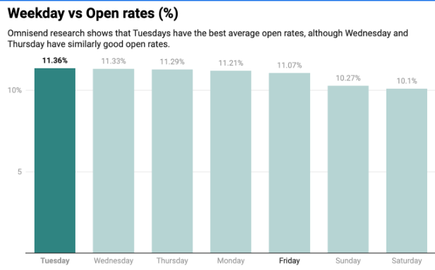 
   

### Horas de envío
- En términos de apertura, el horario comprendido entre las 7 y las 9 am parece tener una ventaja notable.
- Las 6 pm también parece ser el mejor momento para enviar correos electrónicos para obtener la mejor tasa de clics.

 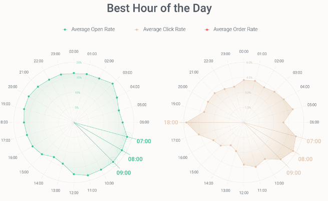 
  

### Emojis: +3%  open rate
Mientras que no son tantos los emails que incluyen emojis, el promedio de apertura es exactamente un 3% más alto que los correos electrónicos sin ellos. Siempre que tenga sentido, podrías intentar experimentar con líneas de sujeto para aumentar tus tasas de apertura.

 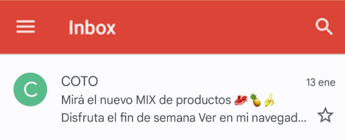 
  

 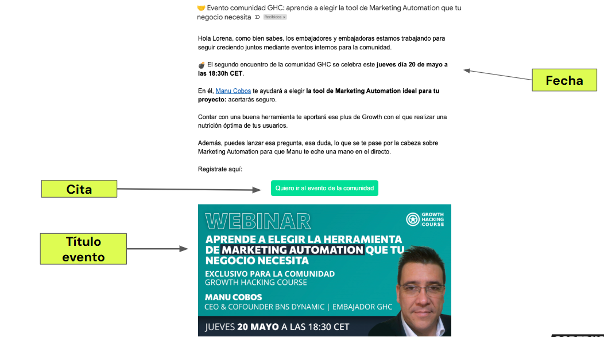 
  

## UX: Diseño y adaptabilidad
Hoy en día se suma un reto más: **el modo oscuro**. Antes de enviarlo, debemos testear que nuestros elementos se vean correctamente en ambas versiones. 
Según análisis que podemos encontrar en la web (no son oficiales), en el 2020 más del 80% de los usuarios de iOS que tenían disponible la opción, eligieron la versión dark de Gmail, y en Android el 95%.
Con respecto a las consideraciones en el diseño, lo que más tenemos que tener en cuenta es usar imágenes transparentes, y prestar mucha atención a cómo se ve el isologo de nuestra marca. 

En este ejemplo, el logo y el rayo tienen fondo blanco y la experiencia en dark mode no es buena.

  
  

El logo, si es negro o muy oscuro, no se va a ver. Entonces lo ideal es agregarle un resplandor o delineado blanco para que en el light no se vea, y en el dark no se pierda. 

 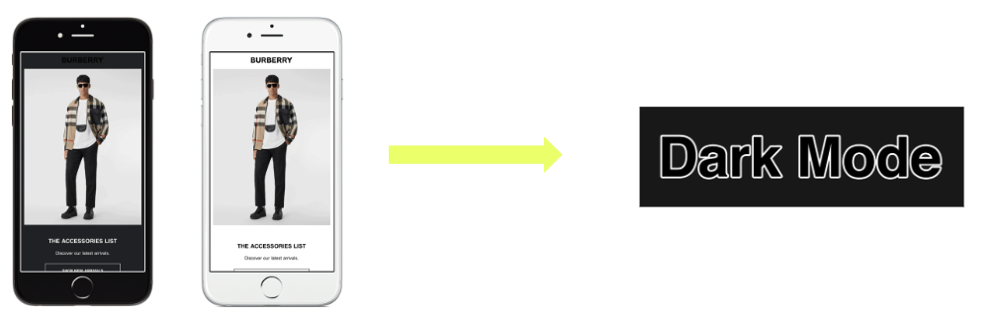 
  

También es muy importante el llamado a la acción del copy. Un buen CTA comienza en la línea de asunto, y sigue a lo largo de todo el correo hasta la firma. 
**Con el CTA debemos anticipar lo que el usuario va a ver**. Es por eso que los CTA del tipo “clic aquí” no son para nada recomendados en el UX, dado que no guían al usuario, no le permiten saber qué tiene que esperar de eso.

Buenas prácticas
- Diferenciable
- Evocar a una única acción
- Persuasivo e imperativo
- Variar entre diferentes emails

 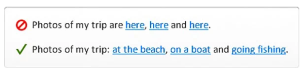 
  

## A/B Testing
Otra recomendación es que **hagamos experimentos** respecto a lo que estuvimos hablando, y dejemos **que los usuarios elijan cuál es la mejor versión**. Algo a considerar en un AB testing es que testeemos un elemento a la vez. Es decir, si vamos a testear la imagen de portada, no testeemos al mismo tiempo 2 variables de CTA, porque no vamos a saber si la mejor tasa de clicks fue ocasionada por el diseño o el llamado a la acción. 

Hay clientes de email, como Mailchimp, que nos permiten hacer estos experimentos de manera muy intuitiva (al momento de hacer un test sobre una campaña aparece esta opción). Como vemos en pantalla, se elige **sobre qué variable queremos trabajar**. 
En el ejemplo a continuación se probarán dos asuntos diferentes; se indica el porcentaje de la base de datos que se usará como muestra (en este caso un 50%), y automáticamente, de acuerdo a la tasa de aperturas de esta muestra, al cabo de 4 hs se envía la versión ganadora al resto de los destinatarios.

 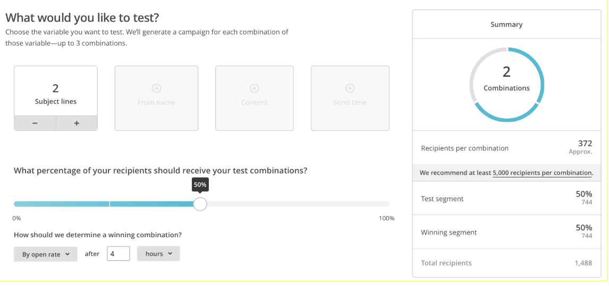 
  

## Herramientas útiles
### Gestión de campañas

| 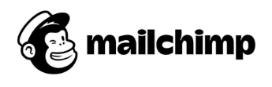 |  | 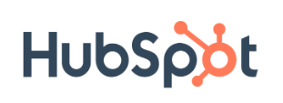 | 
| ------------------------------- | ------------------------------- | ------------------------------- | 
| `https://mailchimp.com/` | `https://www.campaignmonitor.com/` | `https://www.hubspot.com/products/marketing` |
| Integración con apps. | Integración con apps y sistemas de ecommerce (shopify). | Integración con CRM y más de 1.000 apps. |
| Versión gratuita (limitada) | Automatización de emails, Customer Journeys visuales. | Versión gratuita con herramientas de marketing y CRM. |
| Automatización de emails, Customer Journeys. | Landing pages. | Automatización avanzada y flujos personalizados. |
| AB Testings y Landing Pages. | | A/B Testing, Landing Pages y Formularios inteligentes. | 
| Retargeting ads. | | Análisis detallado y seguimiento de leads. |

| 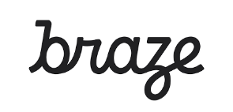 |  | 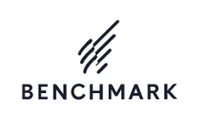 | 
| ------------------------------- | ------------------------------- | ------------------------------- | 
| `https://www.braze.com/` | `https://sendpulse.com/` | `https://www.benchmarkemail.com/` |
| Plataforma avanzada de marketing automation omnicanal. | Herramienta multicanal (email, SMS, chatbot, web push). | Plataforma de email marketing con foco en simplicidad. |
| Integración con apps, data analytics y CRM. | Integración con CMS, CRM y redes sociales. | Integración con e-commerce y CRM populares. |
| Segmentación avanzada y personalización por comportamiento. | Automatización de emails, funnels y campañas transaccionales. | Automatización de correos y campañas por comportamiento. |
| Canales: email, app, web, SMS, push notifications. | Canales: email, SMS, chatbots, notificaciones push. | Canales: email, formularios y landing pages. |

## Clasificación de herramientas y plataformas
### Plataformas integradas

 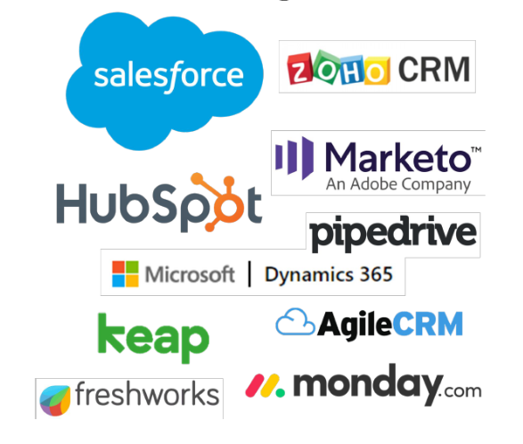 
  

### Plataformas de servicios parciales

 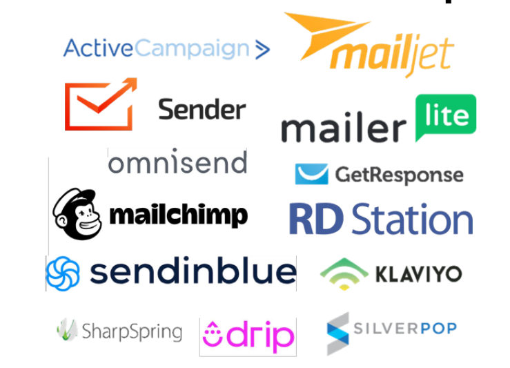 
  

### Plataformas de servicios únicos

 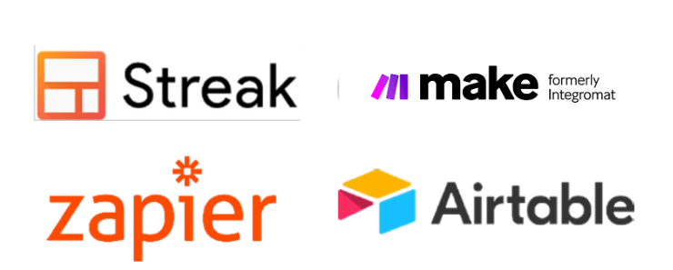 
  

## Bases de datos y segmentaciones
### Datos y comportamiento

| | Datos | Comportamiento |
| -------- |-------|----------------|
| **Definición** | Implica utilizar información demográfica y de contacto para personalizar mensajes según características específicas del público | Implica rastrear las acciones de los usuarios para enviar mensajes más relevantes y oportunos. |
| **Tipo de información** | Ciudad, género, edad, fecha de nacimiento, etc. | Aperturas, clics, compras. |
| **Ejemplo** | Enviar correos electrónicos promocionales sobre productos para el hogar a clientes que hayan comprado artículos similares anteriormente, utilizando datos de historial de compras y preferencias demográficas. | Enviar un correo electrónico de seguimiento con recomendaciones de productos relacionados después de que un usuario haya hecho clic en un enlace específico en un correo electrónico anterior, utilizando datos de comportamiento de clics y navegación en el sitio web. |

### Buenas prácticas para potenciar la tasa de apertura e interacción 
- **Personalización**: Utiliza el nombre del destinatario y segmenta tus listas según intereses y comportamientos.
- **Líneas de asunto persuasivas**: Crea líneas de asunto atractivas y claras que inciten a abrir el correo.
- **Contenido relevante**: Proporciona contenido útil y valioso para tus suscriptores, adaptado a sus necesidades e intereses.
- **Diseño atractivo**: Utiliza un diseño limpio y atractivo que sea compatible con dispositivos móviles y que invite a interactuar.
- **Pruebas A/B**: Experimenta con diferentes elementos, como líneas de asunto, horarios de envío y llamadas a la acción, para encontrar lo que funciona mejor.
- **Frecuencia de envío adecuada**: Encuentra el equilibrio entre mantener la relevancia y no saturar la bandeja de entrada de tus suscriptores.
- **Opt-out claro**: Facilita la opción para que los usuarios se den de baja si lo desean, respetando sus preferencias.
- **Incentivos y ofertas exclusivas**: Ofrece descuentos, promociones o contenido exclusivo para incentivar la interacción.
- **Segmentación dinámica**: Utiliza la segmentación basada en el comportamiento para enviar mensajes personalizados en el momento adecuado.
- **Análisis y optimización**: Realiza un seguimiento de las métricas clave, como la tasa de apertura y clic, y ajusta tu estrategia según los resultados obtenidos.

## Nurturing
Es el proceso de cultivar relaciones con los clientes potenciales a lo largo del tiempo. Implica entender las necesidades y preocupaciones de los usuarios y brindarles información oportuna y útil que los guíe hacia la toma de decisiones informadas. Se trata de un **proceso continuo y personalizado** que permite construir relaciones sólidas con la audiencia y maximizar el retorno de la inversión en marketing.

### Simple nurture
Recolectamos y enriquecemos la base de datos con correos electrónicos específicos, calificando (scoring) a los contactos que interactúan activamente.

Nivel de dificultad: Sencillo 🚀

 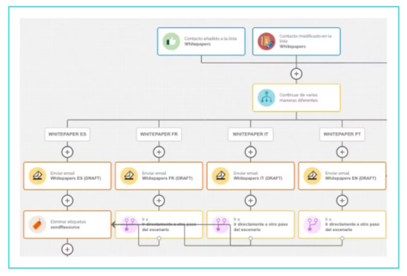 
  

### Product trial nurture
Creamos un workflow para contactos que hagan una de prueba de producto y registramos sus comentarios mediante una encuesta.

Nivel de dificultad: Sencillo  🚀

 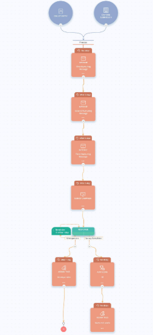 
  

### A/B Testing
¿Qué versión de un email funciona mejor? Nada mejor que un A/B testing.

Nivel de dificultad: Sencillo 🚀

  
  