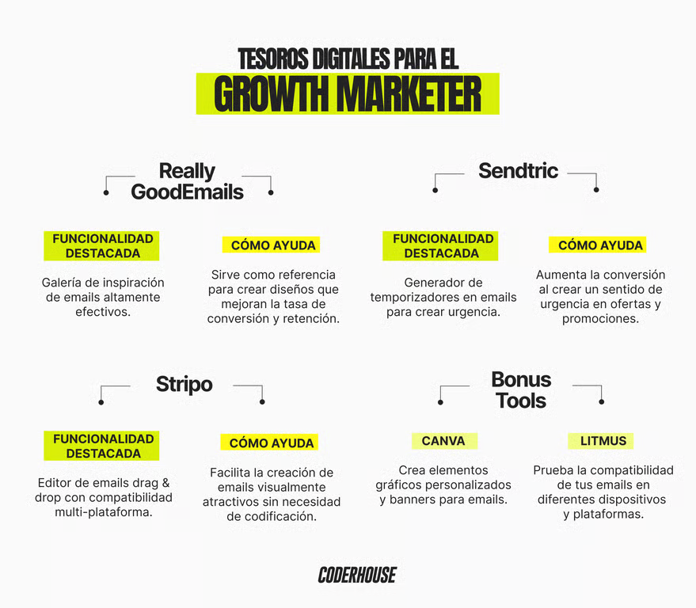

# ​〽️​ Proyecto final y herramientas
## Tesoros digitales para el Growth Marketer

  

En resumen, hemos aprendido que el Email Marketing es una herramienta poderosa cuando se combina con estrategias de segmentación, personalización y automatización. No solo permite conectar con los usuarios de manera más efectiva, sino que también optimiza los recursos y genera resultados medibles y sostenibles a lo largo del tiempo. El éxito en el Email Marketing depende de una ejecución estratégica y del análisis constante de KPIs para adaptar nuestras acciones a las necesidades cambiantes del mercado.