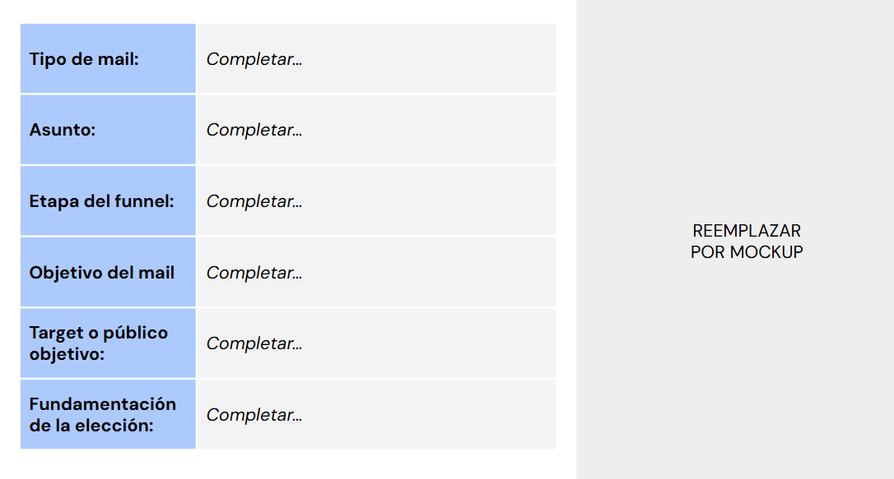

# 🤹 ​Actividad Práctica: Desata el poder del Email Marketing para impulsar tu negocio
## Plan de acción de email marketing
- **Consigna**: 
    - Define un plan de acción de email marketing que contemple al menos 3 emails para las comunicaciones con tus usuarios. El plan de acción debe considerar las etapas del funnel, el target, la fundamentación de las acciones y los mockups que acompañarán cada comunicación.
- **Aspectos a incluir**:
    - Objetivos de comunicación en cada etapa
    - Tipo de email y asunto
    - Target al que se apunta la comunicación
    - Fundamentación y/o justificación del mail indicando el momento en el que se enviará cada uno.(Para email automation, indicar la lógica de entrega de emails y herramienta que se utilizará)
- **📌Tips**:
    - Incluir un sketch o mockup usando Blasamiq
    - La idea es que analices por cada etapa del funnel el tipo de comunicación que mejor se ajuste al usuario

  
