# ​​🎥​ Clase en vivo: Growth Marketing en Redes Sociales

## Estrategia de Growth Marketing en Redes Sociales

- ¿Qué aprendimos?
    - A desarrollar habilidades prácticas en el ámbito del marketing digital, específicamente en el contexto de las redes sociales.
    - A aplicar conceptos teóricos en un escenario realista, promoviendo el pensamiento estratégico, la creatividad y la resolución de problemas. 
    - A comprender la importancia del growth marketing en el crecimiento de una marca emergente, preparándolte para enfrentar desafíos similares en su carrera profesional.

## 💅 Barbie
### La película de “Barbie” se hizo viral y es posible que hayas contribuido a ello

 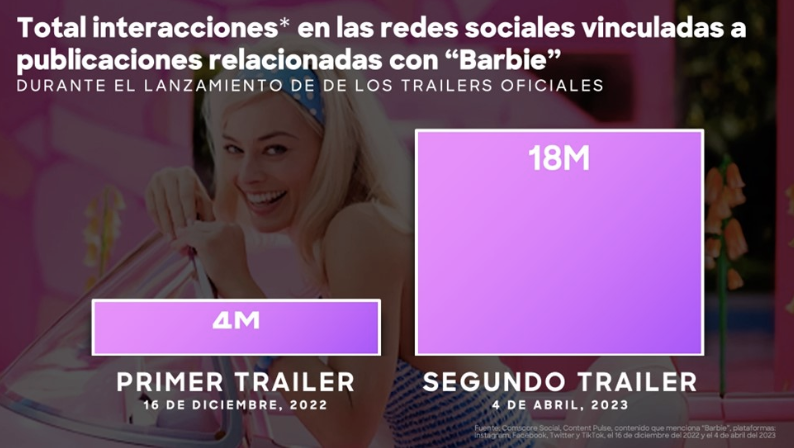 

 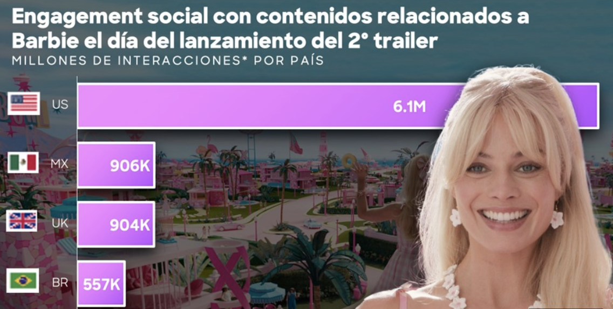 

 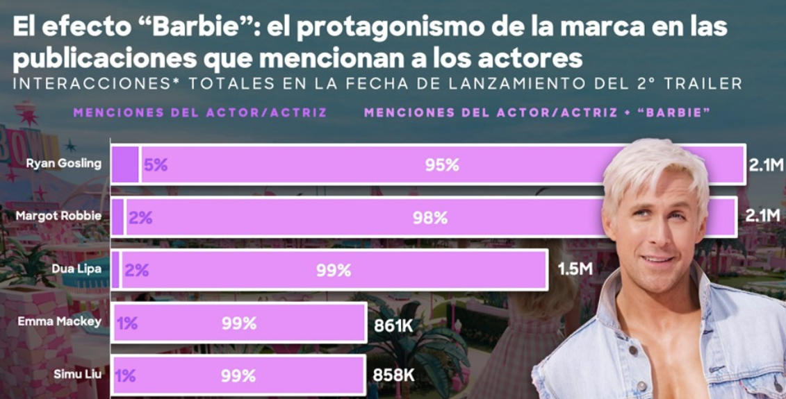 

### Redes sociales

 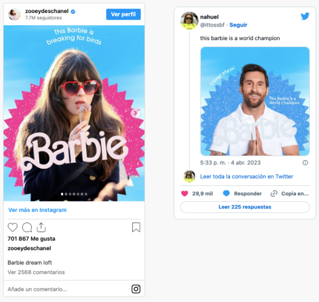 

## Algoritmos sociales
Es un conjunto de instrucciones o reglas (definidas y no-ambiguas), ordenadas y finitas que permiten solucionar un problema y/o llevar a cabo ciertas tareas.

### ¿En qué se basa el algoritmo de Facebook?
- **Relación**: ¿Es una publicación de una persona, empresa, fuente de noticias o figura pública con la que el usuario interactúa con frecuencia? (es decir, mensajes, etiquetas, lo sigue, etc.).
- **Tipo de contenido**: ¿Qué tipo de medios hay en la publicación y con qué tipo de medios interactúa más el usuario? (es decir, video, foto, enlaces, etc.).
- **Popularidad**: ¿Cómo están reaccionando a la publicación los usuarios que ya la vieron? (En especial tus amigos) ¿La están compartiendo, comentando, ignorando o poniendo mil caritas enojadas?
- **Qué tan reciente es**: ¿Qué tan nueva es la publicación? Los posts más nuevos son colocados más arriba.

 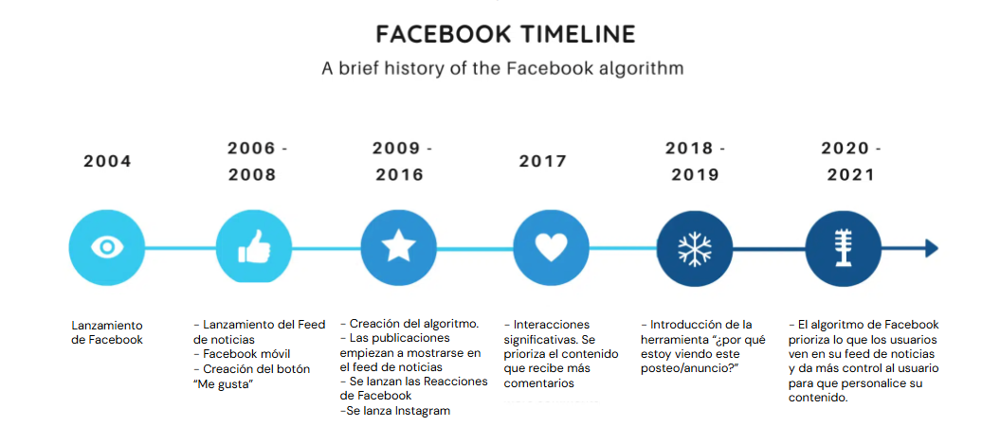 

 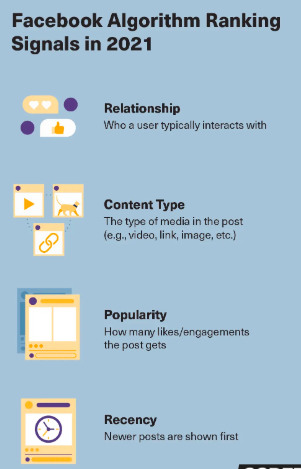 

## Ejemplos para ganar relevancia
- Iniciar conversaciones que hagan que las personas hablen entre sí.
- Videos de alta calidad, + 1 minuto.
- Vivo: 6x más participación que un video normal.

 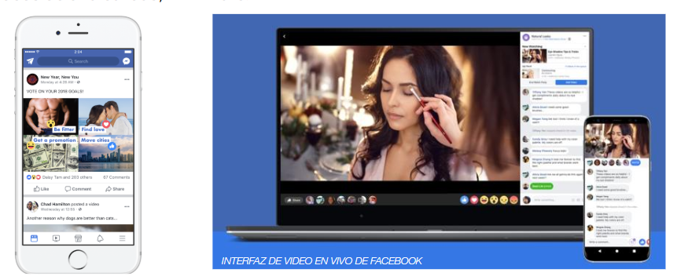 

## ¿En qué se basa el algoritmo de Instagram?
- +interacciones, -likes.
- Los primeros 15 minutos son clave.
- Hashtags precisos.
- Versatilidad en los contenidos.
- No hay un “tipo de contenido” predilecto: depende de cada usuario.

 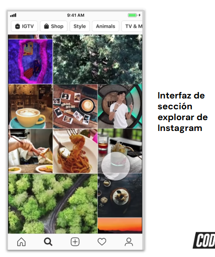 

## ¿En qué se basa el algoritmo de Tik Tok?
- Intereses indicados. 
- Búsquedas realizadas. 
- Visualizaciones (mayor %).
- Comentarios y contenidos compartidos.
- Hashtags, perfil del usuario, idioma y ubicación. 

### Ejemplo del funcionamiento del algoritmo

 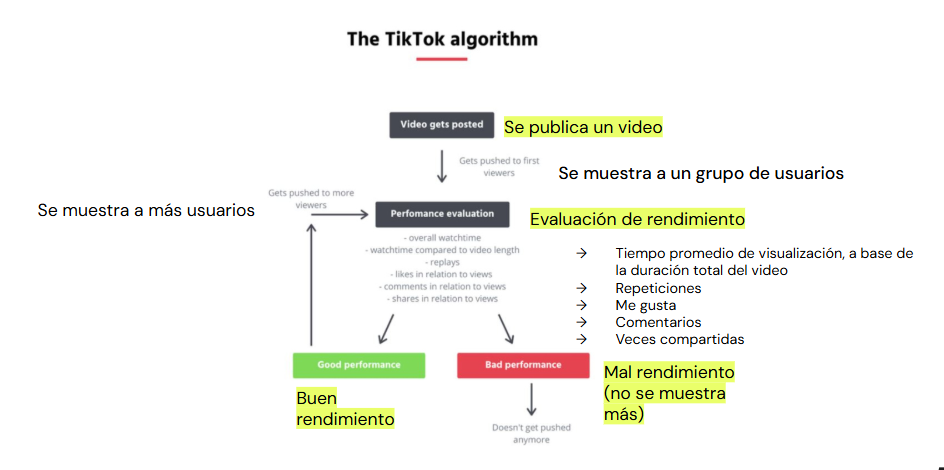 

# Social Media hacks
## Growth Marketing Hacks
- Contenidos efímeros: historias. 
-  +engagement: video y livestream. 
-  Actualización del contenido que hayas publicado anteriormente. 
-  Cada pieza de contenido debe ser publicada en distintas plataformas. 
-  Usar todos los recursos que ofrece la red.

## Gamificación
El arte de **persuadir** a través de técnicas de juego: 

 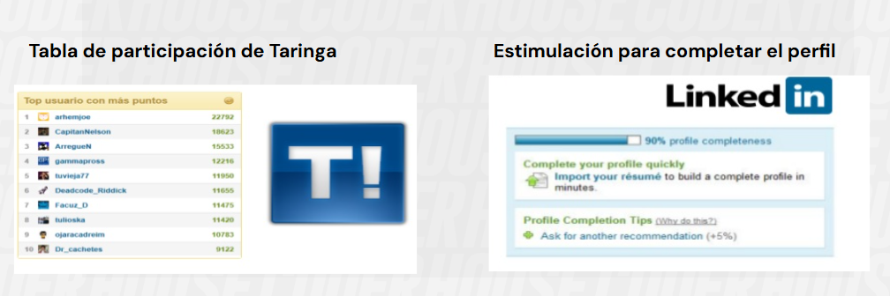 

## Storytelling
> **No vendas, cuenta historias**

Gracias a esta técnica es posible compartir contenidos que tengan un valor adicional, y normalmente ayudan a conectar a nivel emocional a las marcas con los/as seguidores/as. 

### Visual Storytelling

 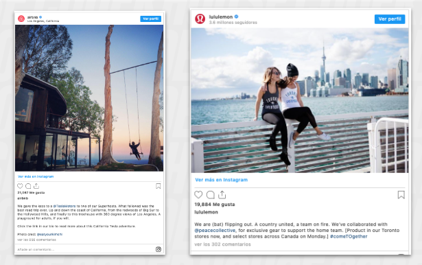 

## El video es el Rey
### Lo efímero siempre es novedad
TikTok - Reels y Streaming en la cresta de la ola.

 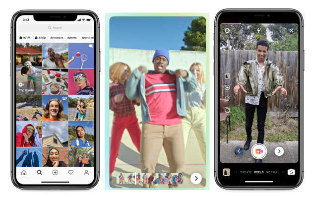 

### Videos cortos, Stories y USC
User generated content - contenido generado por el usuario

 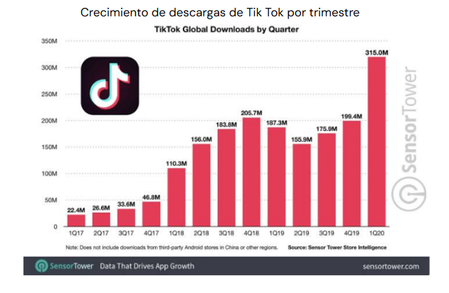 

### Social Gaming (Streaming)

 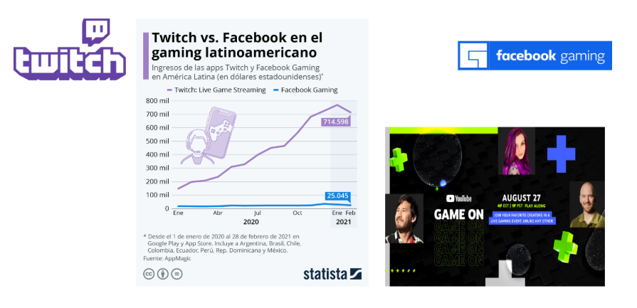 

## Influencers Digitales
Son transmisores, **agentes claves** para la difusión de ideas, Seth Godin, libro “La Vaca Púrpura”

### Consideraciones con Influencers
- El influencer debe pertenecer al rubro, o al menos tener **experiencia** en relación al tipo de producto o servicio que debemos difundir.
- No importa cuántos influencers contratemos para que difundan nuestra marca, si el producto o servicio no es bueno, la difusión terminará en los primeros consumidores.
- Al ser expertos y referentes del sector, deben transmitir nuestra marca como una **recomendación**, no como un vendedor.

### ¿En qué nos pueden ayudar?
- Agregan esa cuota de “prueba social” (social proof) a nuestro producto. 
- Ayudan a que la marca se posicione en audiencias y nichos deseados.
- Incrementan la autoridad de la marca. 
- Aumentan el nivel de engagement.

### Herramientas para trabajar con influencers y PR

|  |  | 
| ----------------------------- | ----------------------------- | 
| Base de influencers, web, blogs, con filtros avanzados | Base de influencers, gestión de campañas, seguimiento en todos los canales e informes. | 
| `https://suite.coobis.com/brand/resources` | `https://socialtalk.io/` | 

### Analiza los niveles de credibilidad de los influencers

 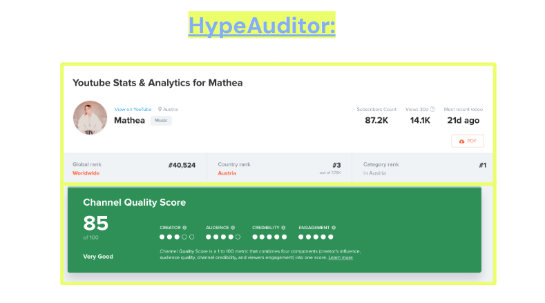 

## Escucha, ¿qué dicen de tu marca?
- Analizar
- Crear alertas
- Herramientas
    - Brandmentios
        - `https://brandmentions.com/`
    - Mention
        - `https://mention.com`
    - Buffer
        - `https://buffer.com/`
    - Hootsuite
        - `https://signup.hootsuite.com/pro-ent-latam-span`
    
## Herramientas

 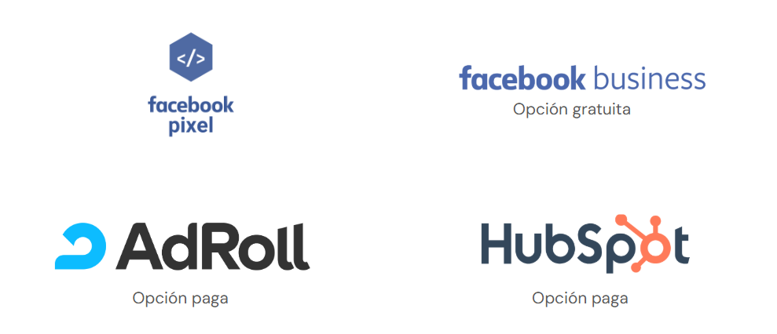 
