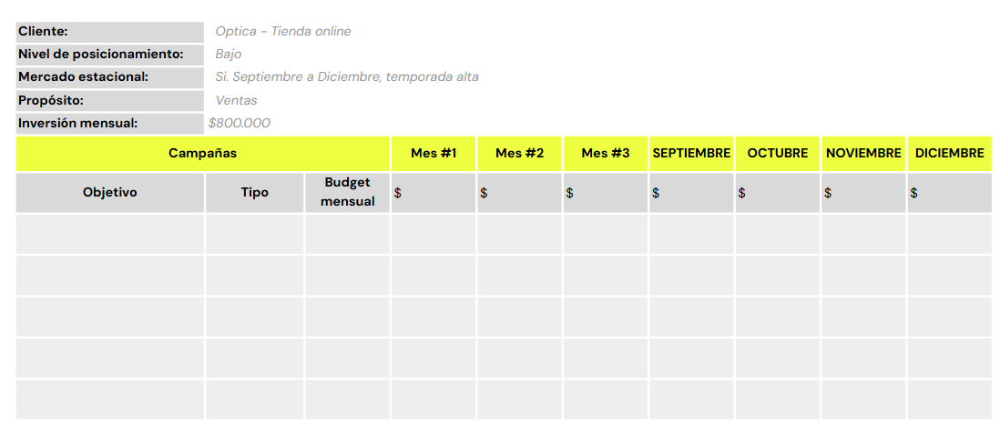

# 🤹 Actividad Práctica
## Social Media en Growth Marketing

- **Consigna**:
    - Desarrolla un plan de social media (para retargeting) con temas y enfoques alineados con las técnicas de Growth Marketing establecidas anteriormente, especificando los canales en los que se aplicará la estrategia y mencionando a partir de qué acción del usuario se desencadenaría dicha estrategia.
- **Aspectos a incluir**:
    - Listado de los canales de comunicación (redes sociales, Google Ads, email marketing).
    - Objetivo por cada canal.
    - Target al que se apunta la comunicación.
    - Mensaje central a comunicar.
    - Tipos de contenidos a publicar.
    - Frecuencia estimada de posteos por semana en cada red.

- **Tip**:
    - Recuerda realizar el plan de social media en base a lo trabajado hasta ahora.
    - No es necesario incluir copys o captions.

## Planificación de Anuncios
- **Consigna**:
    - Define el análisis inicial y los objetivos generales a perseguir con las campañas de anuncios. A partir de ello, crea el mix de campañas y el porcentaje de inversión de cada acción en un corto plazo (6 meses).
- **Aspectos a incluir**:
    - Determinar el propósito de la planificación de anuncios: incremento de ventas, posicionamiento, etc.
    - Definiciones de la cuenta (aspectos iniciales vistos en clase).
    - Tipos de campañas y canales.
    - Cálculo de presupuesto estimado.
    - Distribución de las acciones en el tiempo, siguiendo el modelo de la planilla.
- **Tip**:
    - Haz una copia de la plantilla usada en clases y adáptala a tu estrategia.

  
