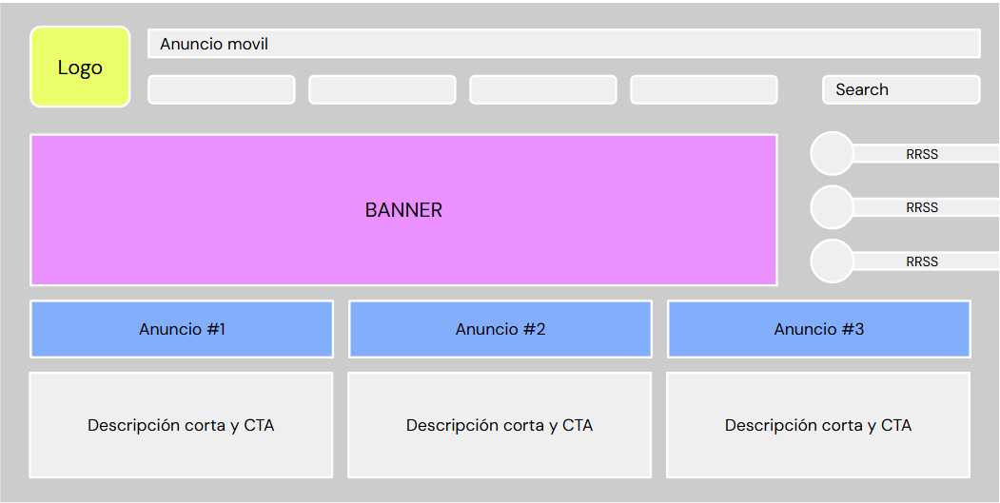

# 🤹 Actividad Práctica - Anuncios: impulsar el Growth en Google Ads y TikTok/Spotify

## Diseñando una landing page
- **Consigna**: Define una acción específica que desees llevar a cabo con tu negocio/proyecto (debe guardar relación con la estrategia que has venido trabajando en la cursada) y en función de ello diseña una landing page.
- **Aspectos a incluir**:   
    - Acción a realizar: anuncio, testimonios, beneficios, etc. ¿Qué esperas que realicen tus usuarios?
    - Objetivo de la acción/landing: ¿Qué deseas lograr?
    - Estructura de la landing: menú, anuncios, títulos etc., según lo visto en clases.
    - Fundamentación de la acción y su relación con la estrategia de Growth Marketing.
- **📌Tips**:
    - Tiene que ser específica, no llevar a la home general.
    - Cuantos más clics pongas por el camino, menos gente llegará a su destino.
    - La estructura puede ser armada con formas geométricas en un PPT o con una app de prototipado como balsamiq.

  
